# 第一章 概论
1. 单CPU；多任务；CPU能和外设并行操作。
## 什么是操作系统
1. OS定义：是配置在计算机硬件上的第一层软件，是对硬件系统的首次扩充.OS是**直接控制和管理计算机硬件、软件资源，合理地对各类作业进行调度**，以方便用户使用的程序集合；完成硬件相关，应用无关的操作。
2. 引入OS的目标：
   1. 有效性：合理分配软硬件资源，组织工作流程
   2. 方便性：提供用户对硬件的接口
   3. 可扩充性：系统互操作，硬件拓展
## 操作系统历史
1. 无操作系统阶段：
   1. 串行，用户人工操作，用户独占全机
   2. 利用率 = 执行时间/(执行 + 读卡时间)
2. 单道批处理系统:
   1. 使用系统提供的作业处理语言JCL将所有作业输入，之后用户不在干预，*提高了利用率*
   2. 一个作业包括：用户程序、数据和作业说明书（作业控制语言）
   3. **批**：一个包含多个作业的，供一次加载的磁带或磁盘，使用一组相同的系统软件
   4. 自动性，顺序性，单道性
3. 多道批处理系统：
   1. 通过作业调度算法，将用户作业放入*后备队列中*，使得作业共享CPU资源（IO和CPU共同工作）。
   2. 宏观上并行，利用率高，但用户交互性差。微观上串行，各任务交替使用CPU。
## 操作系统基本类型
批处理操作系统、分时操作系统、实时操作系统。同时拥有两个以上的称为*通用操作系统*
1. 分时：一台计算机的一个周期分给多个用户使用。
   1.  时间片：将系统资源（尤其CPU时间）在时间上进行分割，每个时间段称为*时间片*，每个用户轮询使用时间片
   2.  分时技术：将处理机时间分成时间片，分配给各联机作业使用
   3.  分时操作系统：是一种联机的*多用户交互式的操作系统*。对每个用户能保证足够快的响应时间，并提供*交互会话能力*。**主要用于交互式作业而不是批处理作业**
   4.  特征：交互性（用户和系统人机对话），多路性（多用户用一个机器），独立性（每个用户独立），及时性（用户能在短时间内获得响应）
2. 实时系统：
   1. *在规定的时间内*完成事件处理。
   2. 分类：
      > 实时控制系统:计算机控制系统，以计算机为核心控制生产过程
      > 实时信息处理系统:响应远程用户的提问，对信息进行检索等.
   3. 实时任务分类：周期性/非周期性
3. 
4. 其他分类：
   1. 多处理机操作系统
      > 紧密耦合,松散耦合
      > 非对称式多重处理,对称式多重处理
   2. 网络操作系统：还能提供网络通信+网络服务。低耦合，以“协议”连接
   3. 分布式操作系统:分散处理和控制，以计算机网络为基础的；高耦合，统一的os
   4. 个人计算机操作系统：
      > 单用户单任务：只允许一个用户上机，且只允许用户程序作为一个任务运行
      > 单用户多任务:只允许一个用户上机，但允许将一个用户程序分为若干个任务并发执行。
## 操作系统基本特征
最基本特征：并发、共享，两者相互存在关联。只有并发才能共享。
1. 并发：多个任务在同一*时间段*发生，操作系统要管理这些并发；并行：同一*时刻*发生。
2. 共享：多个进程**共享有限的计算机系统资源**。操作系统要对系统资源进行合理分配和使用。资源在一个时间段内交替被多个进程所用。
   1. 互斥共享：资源分配后不能被其他进程使用。如打印机
   2. 同时访问，如磁盘文件。
3. 虚拟：一个物理实体（CPU，磁盘）分成多个虚拟逻辑实体（分时，分空间）
4. 异步性：不确定性，进程执行顺序和时间不确定（由于分时等操作）
## 操作系统功能
操作系统组成：
1. 管理模块：针对不同管理对象的程序模块（核心kernel）
2. 用户接口：如外壳(shell)、窗口系统。在shell中，通过运行其他程序来完成各种功能
##### 处理机管理
进行*处理机资源调度*等问题。
1. *进程控制*：进程创建，撤销，挂起等。
2. *进程同步*：同步进程之间的*推进步骤*，分配处理机资源，确保*并发*的作业进程资源共享（互斥，同步方式）
3. *进程通信*：进程之间的数据交互。（读取进程，处理进程，打印进程）
4. *进程调度*：
   1. 作业调度：从作业的*后备队列*中选取若干个创建进程
   2. 进程调度：从进程的*就绪队列*中选取一个执行。
##### 存储管理
目标：提高利用率、方便用户使用、提供足够的存储空间、方便进程并发运行
1. *存储分配与回收*
2. *存储保护*：保证进程间互不干扰、相互保密；
3. *地址映射*：进程逻辑地址到内存物理地址的映射；
4. *内存扩充*：提高内存利用率、扩大进程的内存空间。
##### 设备管理
目标：方便设备使用、提高CPU与I/O设备利用率
1. *设备操作*：通过驱动程序完成对设备的操作。
2. *设备独立性*：提供统一的I/O设备接口，使应用程序独立于物理设备，在同样的接口和操作下完成不同的内容
3. *设备分配与回收*：在多用户间共享I/O设备资源。
##### 文件管理
解决软件资源的存储、共享、保密和保护
1. *文件存储空间管理*：为文件分配外存空间，提高外存效率
2. *目录管理*：解决文件检索问题
3. *文件的读写管理和存取控制*：根据用户需求从外存中存取数据。还要求文件保护，防止没有权限的用户读取。
4. 软件管理：版本管理，依赖管理等
##### 用户接口
*提供一个访问操作系统的友好接口*。一般有命令或系统调用。
1. *命令接口*：
   1. 联机用户接口.为联机用户提供,由键盘操作命令及命令解释程序所组成
   2. 脱机用户接口（批处理用户接口），为批处理作业的用户提供.由JCL组成
2. *程序接口*：用户程序获取系统资源服务的接口，由一组系统调用组成
3. *图形接口*：用户鼠标操作
## OS系统设计
1. 无结构操作系统：由众多过程构成
2. 模块化操作系统结构：模块化程序设计，将OS划分为多个小模块，小模块又分为更多模块。但划分根据功能，*没有区别对待共享资源和独占资源*。所有模块都处于内核中，一个崩溃则整个os都会崩溃
3. 分层式操作系统结构：OS划分为多层，*每一层只能调用低层服务*。
4. 微内核的OS结构：OS内核只实现基本功能，*其他服务由用户态的进程实现*，C/S模式。用户程序（Client）通过OS内核向OS进程（Server）发送请求来获取系统服务。频繁切换内核态，系统并不高效。
## 双模式操作
1. 内核程序是操作系统最重要的程序。操作系统有内核Kernel就够了，但操作系统不只有内核（还有可视化界面等）。
2. 只有Kernel可以执行特权指令（内存清空等）。所以**CPU状态**分为：
   1. 内核态：管态，内核态，特权模式
   2. 用户态：目态，用户模式
3. 在PSW程序状态字寄存器中存在一位用于表示管态和目态。
4. 管态和目态切换方式：
   1. 管--目：一条特权指令，设置PSW对应位为用户态（目态），*表示操作系统主动让出控制权*
   2. 目--管：*由中断引发，只有当需要操作系统处理时，操作系统才强制夺回CPU控制权*；或当用户程序需要调用系统服务时切换。
5. 双模式操作目的：可以确保系统和用户程序不受错误的用户程序的影响.
6. 进行I/O保护：*所有I/O指令都是特权指令*
7. 存储保护：*防止进程访问其他进程内存，必须通过系统调用才能访问OS核心区*；增设**基地址寄存器，界限寄存器**，用以记录进程基地址和使用内存大小。
   1. 核心态（管态）可以访问任何内存（Kernel和用户进程空间）
   2. 设置基地址，界限寄存器的指令是特权指令。
8. CPU保护：存在硬件设置*时钟*，每个用户进程每N毫秒（时间片）中断一次，将CPU还给操作系统，*是实现分时系统的基础*；修改时钟指令是特权指令。

## 做题
1. 单处理机系统中，进程之间不能*直接并行*，而是*宏观并行*，微观串行。处理机和通道、设备之间都是并行的
2. 提高单机资源利用率的技术是：*多道程序设计技术*
3. 多道程序设计技术中，前提条件是能够实现并发，使用进程调度来提高效率，**前提技术是中断技术**。同时，借助中断技术，可以实现某个进程等待IO工作时先执行其他进程，**实现了CPU与IO设备并行**。
4. 操作系统必须提供**中断处理程序**，不一定非要提供系统调用。
5. 系统调用指令**的执行**必须在内核态，*而发生系统调用可能出现在用户态*。
6. 内部中断：CPU内部引起的（异常），如缺页中断，访管trap指令等；外部中断：CPU外部引起，如时钟中断。
7. 系统调用需要保存PSW，而一般调用不需要保存PSW。
8. 外部中断处理过程中，PC、PSW值由硬件保存，然后硬件将状态切换为内核态，*操作系统需要保存通用寄存器*
9. 分层式设计*更加便于调试*
# 第二章 进程的描述与控制
进程：一个具有一定独立功能的程序在一个数据集合上的一次动态执行过程。*是处理机，存储器和外设的最基本单位*
## 程序的执行特征
1. 顺序执行：**单道批处理/程序设计**。有顺序性（顺序执行）、封闭性（独占全部资源）、可再现性（初始条件相同则结果相同）。
2. 并发执行：**多道程序设计***如果不进行额外处理*，则有间断性（运行中可能中断）、非封闭（共享资源，可能被其他进程修改不变特征）、不可再现。所以必须要**额外操作来保证封闭性和可再现性**
## 进程的定义和特征
1. 进程中包含：
   1. 程序代码
   2. 程序数据、堆（程序员分配，malloc、new等，以链表形式存储）、栈（系统自动分配）
   3. PC等寄存器值
   4. 一组系统资源
2. 进程和程序：
   1. 程序是进程基础，进程是程序功能体现
   2. 程序是*静态*的，进程是*动态*的
   3. **通过多次执行，程序可以产生多个进程；通过调用关系，进程可以调用多个程序**
3. 进程特征：
   1. 动态性：创建产生，调度执行，撤销消亡。拥有*动态地址空间*。
   2. 并发性：内存中有多个进程，宏观上同时执行
   3. 独立性：除非相互通信，否则内存相互独立，*是资源调度的基础*
   4. 异步性：每个进程按照独立的速度进行
   5. 结构性：进程控制块(PCB，位于核心区) +  程序 +  数据 =  进程实体
## 进程控制块PCB
进程控制块（PCB，Process Control Block）是描述进程的数据结构，*记录用于描述进
程执行情况及控制进程运行的全部信息*。
1. 进程组成：
   1. PCB：操作系统为每个进程都维护一个PCB，保存进程的动态特征。
   2. 代码块：描述进程功能
   3. 数据块：描述操作对象和工作区
2. **PCB是进程存在的唯一标识**
3. PCB位于*核心区*，只能通过系统调用间接访问
4. PCB有什么：
   1. **进程描述信息**：进程标识符（内部标识符）；进程名（外部标识符）；父进程标识；用户标识符
   2. **处理机状态信息**：保存运行现场（PC，通用寄存器，PSW，栈指针）
   3. **进程调度信息**：用于操作系统调度；包括进程当前状态，优先级，运行统计信息等
   4. **进程控制信息**：程序段和数据段的地址；进程间同步和通信；资源占用信息（剩余资源）；链表存储的下一个进程指针。
## 进程基本状态
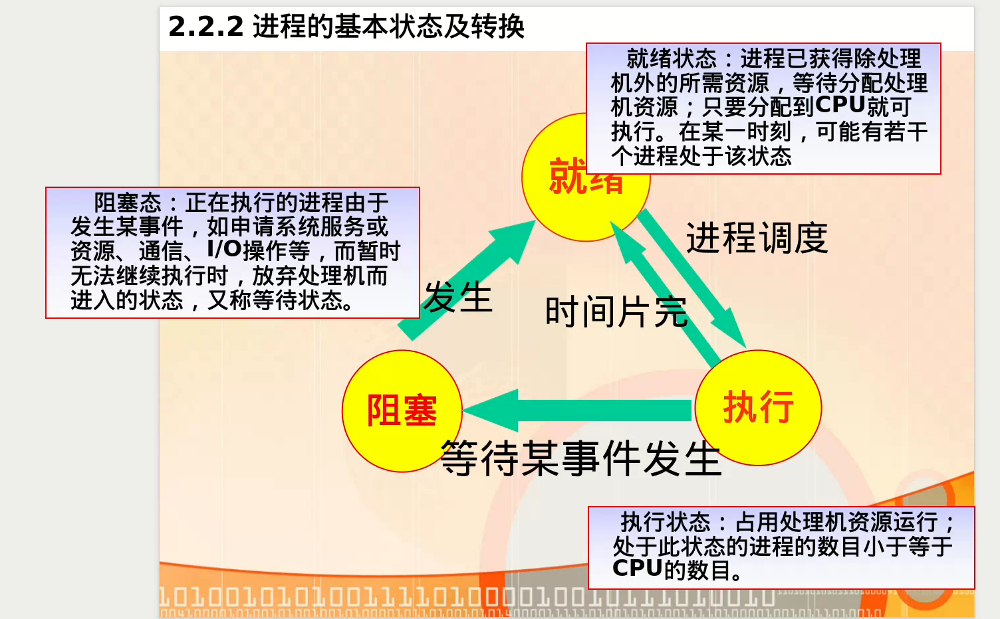
## 进程调度队列
操作系统维护很多队列，*用于表示进程状态*，如就绪队列，各种阻塞队列等；每当PCB记录的状态改变时，会脱离原先队列而加入正确队列。
1. PCB组织方式
   1. 链表
   2. 索引表：同一个状态的PCB装入同一个index表，一个index指向一个PCB。
2. PCB进程切换: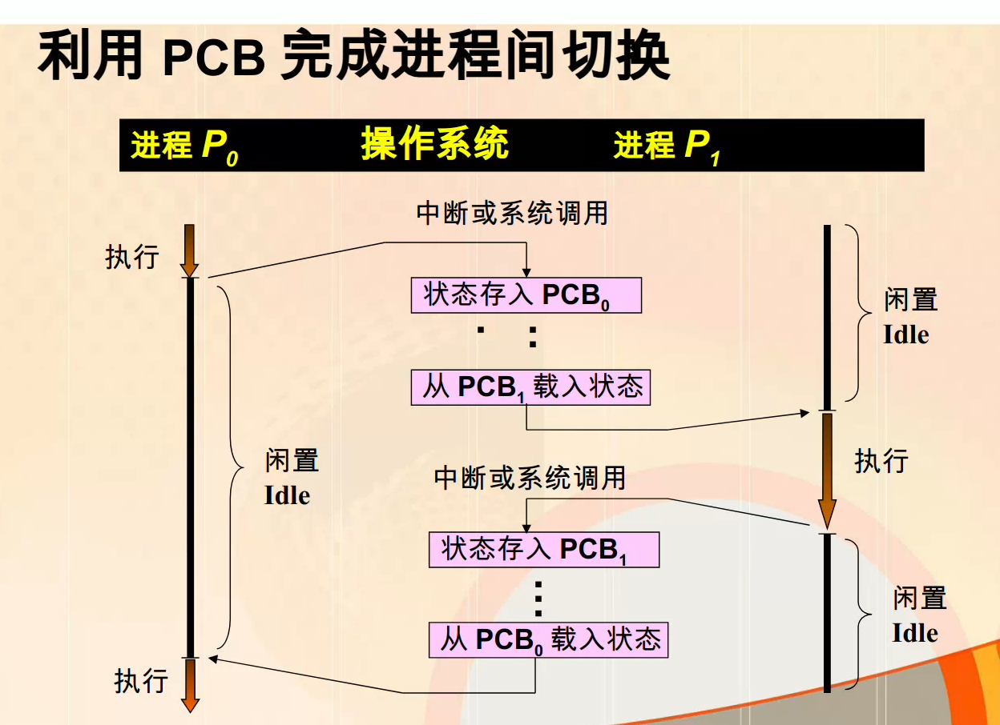
## 进程控制
*进程管理中的最基本功能*
1. 进程生命周期：创建、运行、等待、唤醒、终止
2. 进程控制任务：进程的*创建、终止、进程状态的转变*等
3. 进程控制*由OS内核的原语*完成。
> 原语：由若干条指令构成的“原子操作(atomic operation)” 过程；
> 许多系统调用是原语，但原语不一定是系统调用。

4. 内核Kernel功能：*支撑功能；资源管理功能*
##### 进程创建
1. 父子进程：PCB中包含家族关系表项；子进程可以继承父进程资源，撤销子进程需要归还继承的资源；撤销父进程必须同时撤销子进程。
2. 进程创建定义：发生创建新进程事件后，*调用进程创建原语Creat()创建新进程*
3. 引起进程创建的事件：
   1. 系统初始化（系统内核创建）：分时系统的用户登录；批处理系统的作业调度。
   2. 提供服务（系统内核创建）：*用户请求创建进程*
   3. 应用请求（应用自己创建）：应用调用了原语Creat()
4. CREAT()原语：
   1. 申请空白PCB.
   2. 新进程分配空间.
   3. 初始化PCB：标识符；设置PC、SP；进程状态、优先级
   4. 插入就绪队列
##### 进程终止
1. 终止分类
   1. 正常结束：exit
   2. 异常结束：越界错误、超时错误等
   3. 外部干预：系统kill，（被）父进程终止
2. 终止过程
   1. *查询进程状态*：PCB表中检索出对应PCB，查询对应状态。
   2. *终止执行进程*：若处于执行状态则终止，设置调度标志为真并重新调度。
   3. *终止子进程*
   4. *释放资源*：将资源还给父进程，释放内存和lock
   5. *移除PCB*：将PCB从队列中移除
##### 进程的阻塞
1. 引起阻塞的条件
   1. 请求系统服务
   2. 启动操作
   3. 新数据尚未到
   4. 无新工作可做
2. 阻塞过程
   1. 若正在运行态，则调用阻塞原语BLOCK()，进入阻塞态。（是进程的主动操作）
   2. 引起处理机调度
3. Block()
   1. 保存当前CPU现场
   2. 置PCB阻塞态
   3. 进入等待队列
   4. 引起调度
##### 进程唤醒
1. 唤醒原因：等待的事件到达
2. 当其他进程发送信号到唤醒进程后，设置PCB状态为就绪。
3. WAKEUP()原语：
   1. 从等待队列中摘下被唤醒进程
   2. 置为就绪态
   3. 进入就绪队列
   4. 进程调度
4. Block()和WAKEUP()是功能相反的原语，*一个进程Block后一定要Wakeup*
5. 
##### 进程挂起
1. 挂起原因：
   1. *终端用户请求*：用户发现进程有问题，请求暂停
   2. *父进程请求*
   3. *负荷调节需要*：资源紧张时，将低优先级进程等暂时不执行的进程挂起，腾出空间
   4. *操作系统的需要*：检查资源或记账使用
2. 挂起作用：合理且充分地利用系统资源；进程挂起时，不在内存中，*仅在磁盘上存在镜像*
3. 挂起原语：SUSPEND():
   1. 将进程从内存调到外存，修改状态（PCB不修改）
   2. 若处于活动就绪/活动阻塞状态，则修改为静止就绪/静止阻塞
   3. 若运行，则重新调度
4. 激活原语：active():
   1. 原因：父进程或用户进程请求，或内存已有足够空间
   2. 从外存调入内存，改变进程的状态
5. 
## 进程同步
进程具有**异步性**的特征。
*异步性*：各并发执行的进程以各自独立的、不可预知的速度向前推进。必须要通过某种机制同步起来
1. 进程之间的制约关系：
   1. 间接制约：两进程之间*资源共享*导致的制约
   2. 直接制约：进程间相互合作导致的制约
2. 临界资源：一个时间段内只允许一个进程使用的资源称为临界资源
##### 有限缓冲区的生产者与消费者问题
**生产者进程生产的信息由消费者进程消费**
假设生产者和消费者对于缓冲区有一个变量counter用于记录缓冲区数据数量。
1. 问题所在：
   1. 生产者生产数据后需要counter++;消费者消费数据后需要counter--
   2. 对应汇编代码：
   ```
   // 生产者
   LOAD Reg1 counter
   inc Reg1
   Store counter Reg1

   // 消费者
   LOAD Reg2 counter
   dec Reg2
   Store counter Reg2
   ```
   3. 当并发处理时，生产者和消费者汇编代码可能出现问题
   
2. *进程并发地共享数据导致不一致性*。需要保证counter++和counter--都是原子操作：**全过程无间断一次完成**
##### 互斥方式实现对临界资源的共享
1. 临界资源：硬件或软件（如外设、共享代码段），多个进程在对其进行访问时（关键是进行写入或修改），必须互斥地进行。
2. 临界区：
   1. 临界区是进程访问临界资源的一段代码，进入临界区后，*不允许其他进程进入各自的临界区*
   2. 进入区：进入临界区前检查是否可进入的代码。若可进入则设置”正在访问临界区“标志位。
   3. 退出区:清除“正在访问临界区”标志
   4. 剩余区：其他部分代码
3. 处于临界区时，说明这个进程正在使用处理机，*此时可以进行调度*。但存在一些不能调度的情况：
   1. 中断处理
   2. 处于系统内核的临界区时
   3. 处于必须不能中断的原子操作时
##### 同步机制需要满足的
1. 空闲则入：临界区能够进入则进入
2. 忙则等待：临界区满则进入等待
3. 有限等待：不能死等
4. 让权等待：不能进入临界区则让出控制器（转换到阻塞态）
##### 临界区同步算法
1. 2个进程同步：Peterson算法
2. n个进程同步：面包店算法：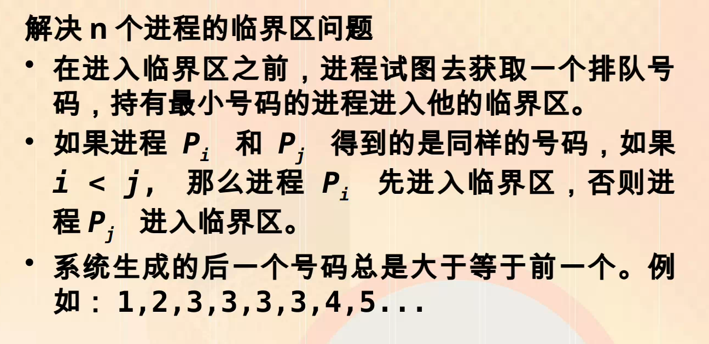
##### 中断屏蔽方法(硬件)
也可以使用中断屏蔽来确保进程的原语性.
1. 过程
    1. 当某个进程访问临界区时,*关中断*,此时不会发生进程切换
    2. 访问临界区结束后,*开中断*,此时可以进行切换
2. 不适用于多处理机,**只适用于系统内核进程,不适用于用户进程**,原因:开关中断指令只能运行在内核态,是特权指令,不能给用户随意使用.
##### TS指令(TestAndSet)(硬件)
1. 也称为Test and set lock指令,*用硬件实现*,执行过程不允许中断.
2. .png)
3. 适用硬件实现,简单快捷,适用于多处理机环境.但*不符合让权等待*,会一直忙等,占用CPU进行循环
##### Swap/Exchange/XCHG指令(硬件)
1. 硬件实现,执行过程不允许中断.类似TS指令,先记录原lock值old,再上锁(lock=true),查看old是不是false,如果是false则说明没人访问临界区,可以访问.
.png)
2. 不符合让权等待.会死等.
## 信号量机制(semaphore) 
##### 信号量设计
信号量是OS提供的管理公有资源的有效手段.
1. 整型信号量:*使用S整型和两个原子操作来标记资源数量,有多余资源则占用一个资源-1,用完退出资源+1*
.png)
2. 记录型信号量
    1. 一个结构体S,包含`int count`,表示*某种*资源数量;一个`PCB链表 queue`表示阻塞在此信号下的进程的PCB队列.
    2. P原语(Wait):
    ```C
    --s.count;
    if(s.count<0){
        BLOCK(s.queue); // 资源量不够则阻塞请求资源的进程,且放入等待队列中.
    }
    ```
    3. V原语(Signal):
    ```C
    ++s.count;
    if(s.count <=0){
        WAKEUP(s.queue); // 释放时增加资源量,并唤醒等待队列的第一个阻塞进程
    }
    ```
    4. `S.count >= 0`:表示剩余资源量
    5. `S.count < 0 `:小于0时,绝对值表示阻塞的PCB量
    6. `S.count`初值为1时,表示只允许一个进程访问临界资源,*实现互斥* 
    7. **进程共享的资源量越多,越容易造成死锁**
3. AND型信号量
    1. 思想:一次性将需要的资源给到进程,只要有一个资源不够就全都不给
    2. 原子操作同时wait:`Swait()`;同时Signal`SSignal`
    3. 注:Swait中,若对于某个$S_i$不够,则将该进程放入$S_i$的等待队列并阻塞,然后回到Swait起点.
    .png)
4. 二进制信号量
    1. 二进制信号量`bin S1=1,bin S2=0,int C=共享资源初值`
    2. 可用于实现整型信号量
5. 信号量集
    1. 为了一次获取多个资源,拓展AND型信号量:`S`信号,`t`下限值,`d`需求量
    2. .png)
    3. 信号量集的使用例:
        > 1.Swait(S,d,d):一次分配d个资源,资源量少于d不予分配
        > 2.Swait(S,1,1):退化为记录型信号量(S>1);互斥信号量(S=1)
        > 3.Swait(S,1,0):可控开关,当`S>=1`则可以进入多个进程,`S=0`就都不能进.
##### 信号量应用
1. *实现临界资源的互斥访问*
设置一个互斥信号量`mutex=1`,并将原语`Wait(mutex)`和`Signal(mutex)`放在临界区上下.
```C
semaphore mutex = 1;   
do{
    …
    wait ( mutex );
    critical section
    signal( mutex );
    remaider section
}while (true);
```
> 注意:`wait`和`Signal`必须成对出现,缺少wait则不能互斥访问临界资源,缺少signal则资源不会被释放.
2. *实现同步操作*:
    1. 前驱关系:并发执行的进程`P1,P2`,要求对应代码`C1`在`C2`之前完成
    2. 设置互斥信号量`S12 = 0`.
    ```C
    C1;
    signal(S12)

    ///
    wait(S12)
    C2;
    ```
    3. 必须等C1结束后S12++,C2才能跳出wait()执行.
3. *同步操作例题*:
    1. .png)
    2. .png)
## 管程的基本概念
管程是一种*进程同步方法*.
1. 为什么引入管程:当使用信号量同步时,若同步进程过多,信号量分散,导致管理困难,容易死锁.
2. 管程目的:记录资源,所有访问资源的进程必须通过管程,且管程只允许一个进程访问,实现了互斥.*但使用信号量的效率比管程高*.
3. 管程定义:
    1. 对于某个资源,管程定义了一个*数据结构和对这个结构的操作*,可以通过这些操作同步进程,修改数据结构中的数据.每次只允许一个进程进入管程,若多个进程进入,则只有当第一个进程使用完并释放后才能下一个.
    2. 当进程进入管程被阻塞后,只有当前使用管程的进程将管程释放后才能让其他进程使用管程.为了区分等待原因,定义条件变量`condition x,y,...`和两个原语`wait(),signal()`.对于每个原因,若某个进程因此原因被阻塞,则进入对应condition的等待队列.
    3. 当`x`条件不满足时,调用管程的进程会调用`x.wait`,使得调用进程阻塞并进入等待队列;当`x`条件变化后,`x`调用`signal`唤醒队首进程.
## 经典的进程同步问题
##### 生产者消费者问题
一个生产者生产数据,放入*缓冲区*;一个消费者消费数据,从*缓冲区*取出数据;
当缓冲区不满时,生产者才能生成;缓冲区不空时,消费者才能消费;
*缓冲区是临界资源,各进程必须互斥访问*
1. .png)
2. .png)
3. 注意:必须先进行资源信号量的wait,再进行互斥信号量的wait,否则会死锁.
4. 总结
.png)
##### 读者,写者问题
1. 问题:.png)
2. .png)
3. .png)
4. .png)
## 进程通信
每个进程拥有的内存空间是独立的，不能相互直接访问。需要进行进程通信。
1. 进程通信分类
   1. 低级通信：包括状态和简单的整数传递，如信号量和管程机制。*信息量较小，效率低，实现复杂*
   2. **高级通信**：用复杂数据结构传递的大数据量通信，通信效率高。*共享存储器系统、消息传递系统、管道通信系统*。
##### 共享存储器系统
通过增加段表页表的方式，可以将某个内存空间设置为共享空间。
1. 为了避免写冲突，共享空间*互斥*，可以使用操作系统提供的PV操作实现。
2. 共享内存通信的分类：
   1. *共享数据结构*（低级通信）：低效，OS提供共享存储器，用户程序员自己设计数据结构，实现同步通信，*效率低，通信量小*。
   2. *共享存储区*（高级通信）：可以传递大量数据。进程通信前向os*申请一块存储区域*，若不存在则划分，存在则返回区域标识符，并将该进程连接上去。*数据的结构和同步都由进程管理，而不是os*
##### 消息传递系统
程序员直接利用系统提供的一组通信原语进行通信。分为直接通信和间接通信。
1. 直接通信：
   1. 使用os提供的通信指令来通信，以显式方式提供对方标识符：send/receive($P_i$,(&)message)。
   2. 接受进程的PCB内存在消息队列，$P_1$send后将msg放入对应进程$P_2$PCB的消息队列中，$P_2$receive($P_1$,&msg)后将消息队列的信息放入msg中，获得通信的信息。
2. 间接通信：借助os提供的共享数据结构信箱原语进行通信。
   1. 有私人信箱（其他进程只能放入消息），公用信箱（可以通过os核准后发送消息和接受消息）和共享信箱（拥有者批准某些进程访问，每个进程可以取走自己的信息）
   2. 
##### 管道通信系统
管道通信系统拥有*一个读进程，一个写进程，一个管道文件pipe*.
1. 写进程可以将大量字符流数据写入pipe，读进程读，*需要互斥，同步，且需要实现判断对方是否存在，存在才可通信*
2. 半双工通信，同一时间只能单向传输。想要同时双向传输需要两个管道。
3. 管道满时写进程阻塞，空时读进程阻塞。
## 线程（Thread）
线程是比进程更小的可独立运行的*基本单位*。引入线程的目的是用它来提高系统内程序的并发程度.提高系统效率，增大系统作业的吞吐量。
1. 线程与进程比较：
   1. 引入线程后，**线程是处理机分配（调度）的最小单元，进程是除CPU外的系统资源分配的最小单元**。
   2. 线程之间可以并发执行，且共享同一个内存空间。
   3. 进程切换时需要切换环境，开销大；线程不用，开销相对较小。、
   4. 线程同样具有*就绪、阻塞和执行*三种基本状态。
2. 线程的属性
   1. 共享进程资源：进程的地址空间，信号量，计时器等
   2. 轻型实体：每个线程只拥有少量资源(标识符，TCB：包含PC和少量寄存器信息，核心栈，局部变量)
   3. *调度最小单位*
   4. 可并发执行
3. 线程优点：
   1. 一个进程多个线程，线程并发执行
   2. 创建和终止时间短
   3. 线程之间共享资源，不用通过系统内核
4. 线程缺点：*一个线程崩溃则整个进程崩溃*
##### 用户级线程
仅存在于用户空间中，无需内核支持，内核不知道线程的存在。**一个线程发起系统调用而阻塞，则整个进程都要等待**。由*线程库*实现，所有线程相关操作都由应用程序完成，在用户态实现，速度快。
1. 当一个时间片被分配给进程，则需要额外分配给多个线程，*每个线程得到的时间少*。
2. TCB在用户空间中。
##### 内核级线程
由OS支持，用户程序和内核程序线程都由内核操作，一个线程阻塞不会导致整个进程被阻塞，*能在多处理机上并行执行*。
1. TCB在内核空间中
2. 线程切换在内核态，切换开销大。
3. 有不同多线程模型：
   1. 多对一模型：多个用户级线程*运行在一个内核线程上*，仍然需要线程库帮助，一个阻塞则全部阻塞，线程切换在用户态进行，不能再多处理机上并行。**重点：操作系统只看得见内核级线程，处理机调度分配的基本单位是内核级线程**
   2. 一对一模型：一个用户级线程阻塞后不影响其他线程，但切换线程需要切换到内核态，且创建线程开销大，*限制了线程总数量*。
   3. 多对多模型：n个用户线程通过*多路复用*分配到$\leq$n个内核级线程上。允许操作系统根据资源配置情况控制创建内核线程的数目。**内核级线程才是处理机调度的基本单位**。
## 做题
1. 单处理机系统中，**每个时刻最多有1个进程处于运行态。**也可能没有运行态：死锁，**此时全都在阻塞态**
2. 线程切换*可能引起进程切换*：从A进程的线程切换到B进程的线程
3. **引入线程可以减少程序的时空开销**
4. 用户级线程**不能再多处理机上并行**，因为操作系统只能看到进程。
5. 线程不共享进程的栈。
6. 临界区是指*访问临界资源的代码段*
7. 管程的Signal和V操作不同。V操作一定会使S=S+1，而Signal只会改变某个条件变量，*若没有被阻塞的进程，是不会被改变的*。
8. 管程执行wait后一定会将进程阻塞，放入阻塞队列；通过signal来唤醒阻塞队列第一个进程。
# 第三章 处理机调度与死锁
## 处理机调度的层次和调度算法的目标
##### 作业和进程
1. 作业：（用户）利用计算机进行一次运行所需工作的集合。要完成一个工作，用户必须先提交一个作业。*一个作业可能由多个程序构成*。现在的PC和服务器基本没有作业概念。
2. 作业和进程差别
   1. 作业是用户向计算机提交的*任务实体*。进程是完成用户任务的*执行实体*，是资源分配的基本单位。
   2. 作业建立完毕后放在*外存*等待处理，进程创建后一直在*内存*运行
   3. 一个作业由至少一个进程组成
   4. 作业多用于批处理系统，进程可以用在几乎任何多道程序处理系统
3. 作业调度和进程调度
   1. 作业调度：系统资源满足后，将作业*放入主存储器中*
   2. 进程调度：使作业进程占据处理机
4. 批处理型作业调度过程可能经历*高级（作业）调度，中级（内存）调度，低级（进程）调度*。
##### 调度基本类型和调度方式
1. 调度概念：**在多道程序环境下，进程数目往往多于处理机数目。要求系统能按某种算法，动态地将处理机分配给就绪队列中的一个进程，使之执行**
2. 高级调度：用户有一个任务（多个作业）要做，将这些作业放入外存，并告诉操作系统要完成它。此时os需要启动多个进程来完成这个工作，然而内存等资源可能不够，不能同时启动这些进程来完成所有作业，此时需要进行作业调度，
   1. 又称作业调度或长期调度。根据某种算法，将外存中处于*后备队列*的某个作业调入主存.
   2. 作业创建时建立PCB，作业结束后才撤销PCB
   3. 无→创建态→就绪态
3. 中级调度（内存调度）：
   1. 为了提高吞吐量，降低负荷，系统会将一些就绪/阻塞态的进程挂起，放入外存。
   2. 当系统资源足够，内存稍有空闲时，*通过某些算法将挂起的就绪进程* **对换** *回内存，放入就绪队列*。
   3. 频率比高级调度高。
   4. 挂起态→就绪态
4. 低级调度（进程调度或短期调度）：会根据某种算法将就绪队列的进程通过dispatcher调度程序分配处理机。
   1. **最基本的调度，频率最高**
   2. 就绪态→执行态
5. 调度方式
   1. 非抢先式调度：一旦将处理机分配给某个进程，除非该进程结束或阻塞（调用原语、出错、等待I/O），否则一直占用处理机。
   2. 抢先式调度：运行暂停某个正在执行的程序，将处理机分配给其他进程。有时间片原则，优先级原则和短作业优先原则。
##### 调度队列模型
1. 仅有进程调度：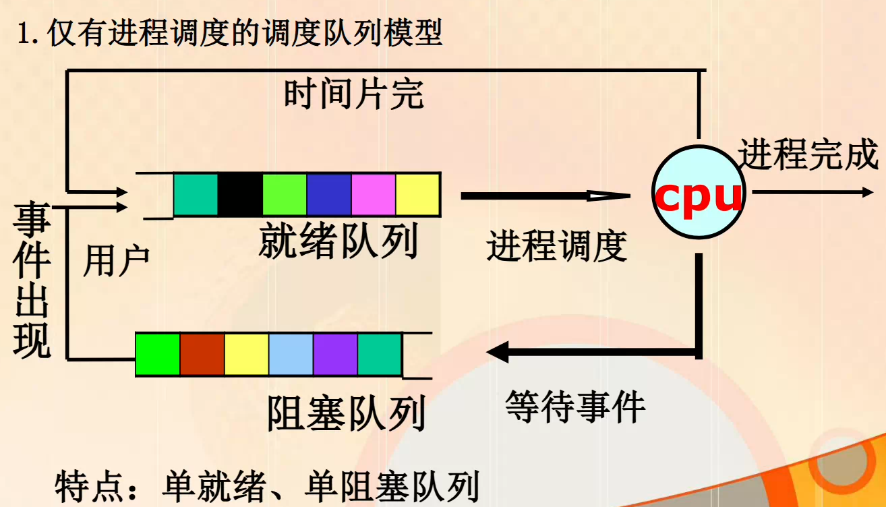
2. 具有高级（作业）和低级（进程）调度：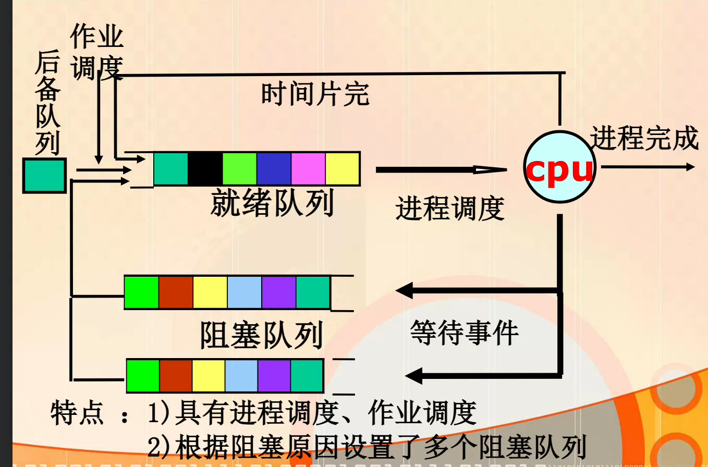
3. 3级调度模型：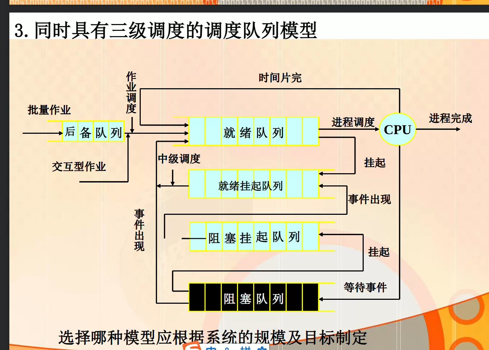
##### 选择调度算法的准则：系统准则
1. *CPU利用率*：工作时间/总时间；
2. *系统吞吐量*:*使用尽可能少的时间完成多的工作*。系统吞吐量=总共完成了多少道作业/总共花了多少时间。
3. *各种资源的均衡利用*：系统资源的合理利用。处理机和IO繁忙搭配。
##### 选择调度算法的准则：用户准则
1. *周转时间*:**作业从提交到完成（得到结果）所经历的时间为周转时间**。
   1. 包括了：外存后备队列等待时间，就绪队列和阻塞队列等待时间，CPU执行时间，输出时间
   2. **所有作业的**平均周转时间为*所有作业的周转时间/总a作业数*：$\bar{T} = \frac{1}{n} × \sum_i^n(T_i)$
   3. **某个作业的**带权周转时间为*$\frac{作业周转时间}{CPU实际运行时间}=\frac{作业执行总时间-作业提交时间}{作业执行总时间}$*
   4. 平均带权周转时间
2. *等待时间*：指用户的进程或作业*处在等待处理机的状态*的时间之和。等待时间=等待被CPU服务的时间=作业在外存后备队列等待的时间+建立进程后等待服务的时间；*等待I/O完成也属于被服务，不算等待时间。*
3. *响应时间*：分时系统的重要指标。指*用户输入一个请求开始到系统首次响应的时间*。包括用户输入时间，处理机处理时间，处理结果送到终端显示器的时间。
4. *截止时间*：分时系统的重要指标。开始截止时间（某个任务最迟的开始时间）和完成截止时间（某个任务最迟的结束时间）。
5. 优先权原则：让关键任务得到更好的指标。
## 调度算法
##### 作业调度算法
1. *FCFS(First Come First Serve)算法*：最简单的算法，*适用于作业调度和进程调度*
   1. *按照作业提交或进程变为就绪态的顺序*依次获取CPU，一直占用直到阻塞或结束（非抢占）
   2. 当阻塞态恢复后，重新去就绪队列排队。
   3. *有利于长作业/IO不忙/CPU繁忙作业而不利于短作业/IO繁忙作业*
   4. 公平，*不存在饥饿现象*（某个作业/进程长时间得不到处理）
2. *短作业（进程）优先调度算法(Shortest Job/Process First，SJF/SPF)* 
   1. *预计执行时间短的作业优先获得处理机，但不会抢占当前拥有处理机的进程*
   2. 降低平均周转时间和平均带权周转时间，提高吞吐量。*当所有作业几乎同时到达（同时可执行）时，SJF的平均等待时间，平均周转时间最短*
   3. 对长作业很不利，不能考虑紧急程度，而且难以估算执行时间。
   4. *最短剩余时间优先*（SJF的变形，SRF，Short Remain First）,允许执行时间比当前处理机处理的进程剩余时间更短的进程**抢占**处理机。
   5. 不公平，*可能存在饥饿现象*
3.  *最高响应比优先*（SJF变形，HRRN，Highest Response Ratio Next）：
    1.  *非抢占式*，当处理机空出时，计算响应比最高的进程调度。
    2.  响应比R = (已等待时间 + 预期执行时间) / 预期执行时间，是FCFS和SJF的折衷
    3.  当等待时间全一样时，执行时间越短越调度：SJF；服务时间相同，谁等的多谁调度：FCFS；
    4.  响应比的计算增加系统开销。
    5. 不会饥饿
##### 进程调度算法
1. *时间片轮转法*（Round Robin, RR）：
   1. 主要用于微观（进程）调度。*提高资源利用率*。**是抢断式算法**。
   2. 首先将所有进程按照FCFS排成就绪队列，每次给队首处理机，时钟装置发出时钟中断来通知进程时间片完。中断后将进程放到就绪队列尾，上下文切换将处理机给到新队首。
   3. 就绪队列进程越多，时间片越短。时间片过短时，平均（带权）周转时间变长，切换开销过大，处理机资源大量被用于切换。时间片过长时，退化为FCFS， 进程响应时间变长（例如10个进程等待，1s时间片，则用户输入要等待至少9s才有响应）。
   4. 所以设计时要将时间片时间设定为切换耗时仅占用1%。
2. *优先权调度算法*(Priority Scheduling)：
   1. 可用于作业/进程调度。将优先级最高的作业从后备队列放入主存；给优先级最高的就绪队列进程处理机。
   2. 分为抢占式和非抢占式。*可抢占程度越高，系统实时性越好*。有
   > 1. 完全不抢占：可能会导致某进程死循环长期占用CPU
   > 2. 系统态完全不抢占
   > 3. 内核部分可抢占：在可抢占点进行抢占
   > 4. 完全可抢占或内核完全可抢占
   3. 优先级划分：
   > 1. 静态优先级：创建时获得一个优先级，之后*不变*。系统进程优先数高，资源占用少的优先数高；这样系统开销较小。
   > 2. 动态优先级：创建时获得一个优先级，之后*根据情况改变*。等待时间长就增加优先数，运行久则降低优先数。
   4. 系统进程>用户进程；前台进程>后台进程；I/O型进程>普通进程（IO型进程能够和CPU并行操作）；
3. *多级反馈队列调度算法*(Round Robin with Multiple Feedback)
   1. 结合所有方法的特点。*抢占式算法*
   2. 设置*多个优先级的就绪队列，优先级越高则时间片越短*。当一个新进程创建时，优先进入最高级队列，一个时间片未运行完则降低一级队列，放到队尾，一个时间片未执行完再降低一级...。高优先级队列可以抢占处理机，被强占的进程放到*原队列末尾*。
   3. 照顾短进程：缩短周转时间，增大吞吐量；照顾IO进程：降低响应时间，增加IO设备利用率；不必估算进程执行时间，动态操作。
   4. 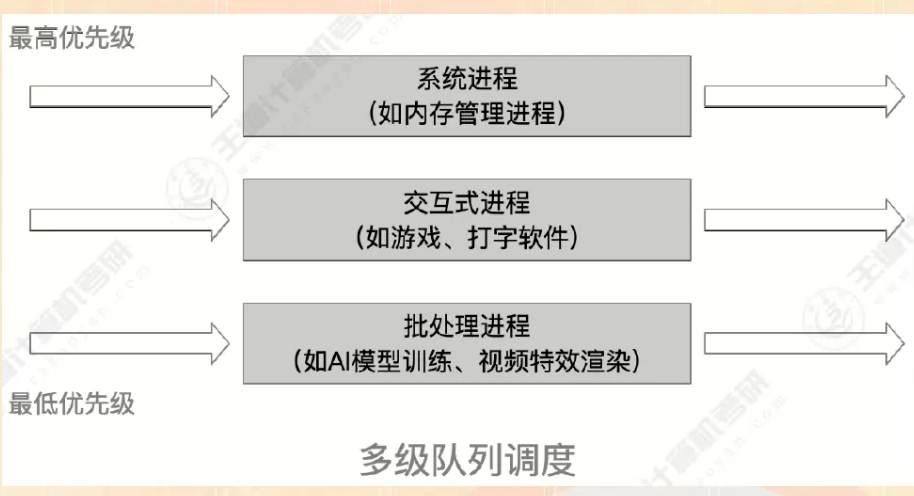
## 实时调度
1. 实时调度分类：
   1. *硬实时调度*：有一个最后期限，完不成对系统造成很大损失。
   2. *软实时调度*：有一个最后期限，但超过期限完成也有意义
2. 实时调度前提：
   1. 提供相关信息：就绪时间；开始截止和完成截止时间；消耗的资源；处理时间；优先级
   2. 系统处理能力强；若不能完成则加强单处理机性能或增加多处理机。
   3. 抢占式调度：具有*硬实时调度的广泛采用抢占式调度*
   4. 拥有快速切换功能。
3. 非抢占式调度算法（用于非周期类实时任务）分类：
   1. 非抢占式*轮转调度*算法：数秒延迟
   2. 非抢占式*优先调度*算法：相对严格，数百毫秒
   3. 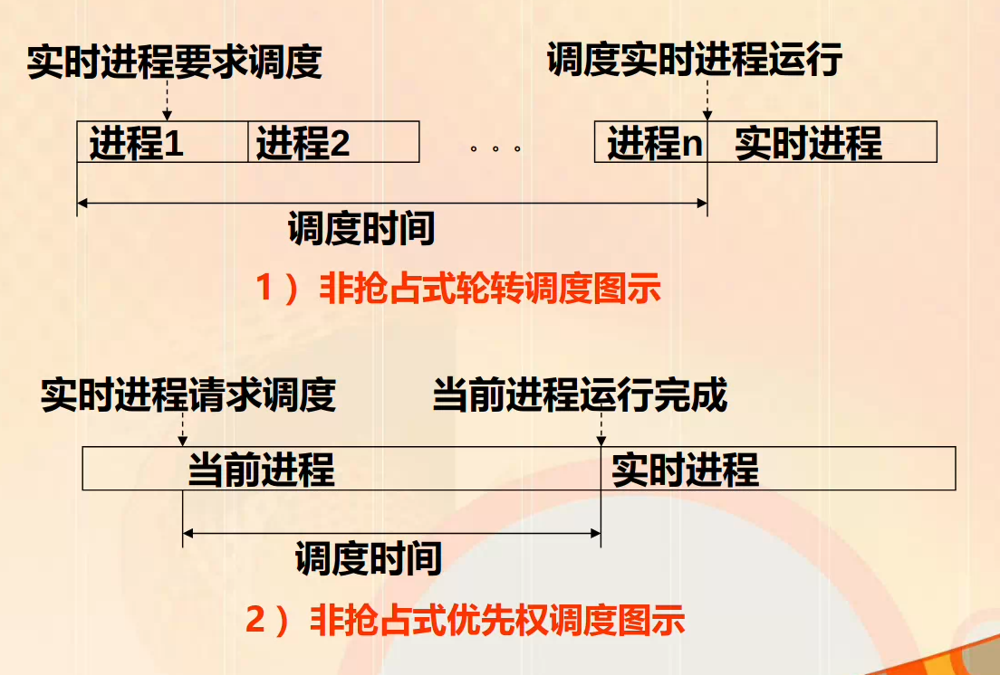
4. 抢占调度算法（用于周期类实时任务）分类：
   1. 基于*时钟中断*的抢占式优先权调度：实时进程来到后不立即抢断，*而是等待时间片完再让出*。几十毫秒-几百毫秒。
   2. *立即抢占*的优先权调度算法：只要不在临界区，就直接抢占。几百微秒-几毫秒。
##### 常用的实时调度算法
1. 最早截止时间优先算法EDF（Earliest Deadline First）：
   1. 维护一个实时进程队列，*按照截止时间（开始/结束）从早到晚排序*，每次调度都将处理机给第一个。
2. 最低松弛度优先LLF（Least Laxity First）算法
   1. 用于抢占调度，计算队列中实时进程的紧急（松弛）程度并排序。
   2. 紧急（松弛）程度 = 必须完成的时刻 - 执行时间 - 当前时刻
   3. 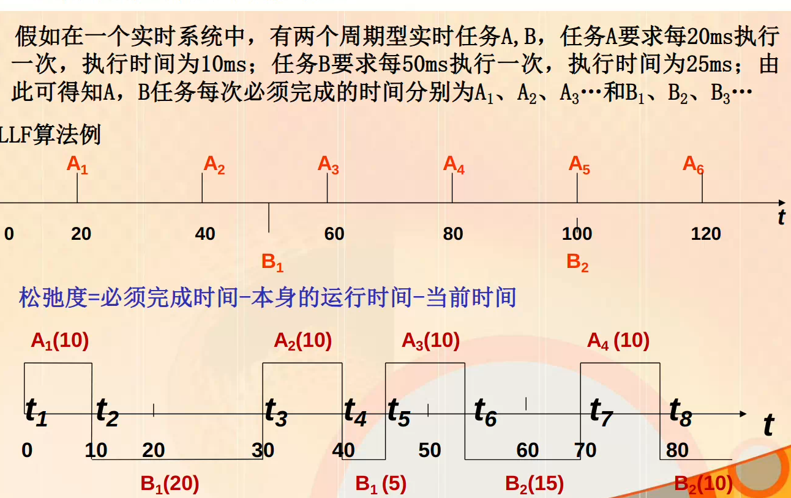
## 死锁概述
1. 什么是死锁：是指多个进程在运行过程中因争夺资源而造成的一种僵局，当进程处于这种状态时，若无外力作用，它们都将无法再向前推进
2. 死锁原因：
   1. 可剥夺和不可剥夺资源：
   > 1. *竞争不可剥夺资源*：某个进程获得不可剥夺资源后，只有当使用完才能给其他进程。当两个进程分别拥有部分需要的不可剥夺资源，且一直请求对方拥有的资源时，两个进程死锁。
   2. *竞争临时性资源*：动态生成和消耗的资源。两进程相互请求对方生产的临时性资源时，而不产出对方需要资源时，死锁。
   3. *信号量的使用不当造成死锁*：当互斥的P操作在实现同步的P操作之前，死锁。
3. 死锁必要条件
   1. 
   2. *当死锁时一定会有循环等待（循环等待是必要条件），而循环等待未必死锁（非充分条件）*
## 死锁处理
1. 预防死锁
   1. *破坏互斥条件*：只有对互斥资源进行争夺时才发生死锁。使用某种技术将独占资源转换为共享资源。但难以实现，或互斥必须保持
   2. 破坏“请求保持”条件：必须资源分别在多个进程手里，相互之间请求资源，死锁。可以使用*静态分配*策略，一次请求全部资源，只有当全部空闲才能分配到。资源浪费，利用率低。
   3. 破坏“不可剥夺”条件：获取到的不可剥夺资源必须使用完才释放。频繁释放资源，吞吐率降低。
   > 1. 某个进程已经请求到某些资源，再请求资源不能满足时，*释放所有资源*
   > 2. 根据优先级，当某进程得不到资源时在OS帮助下强行剥夺
   4. 破坏“环路等待”条件：有序资源使用法，将资源分类并排序，每个进程按照资源序号请求资源，不形成环路（*持有小序号资源的进程才能请求大序号资源，而持有大序号资源的进程不能逆向请求小序号资源*）。降低利用率，限制自由编程。
2. 避免死锁：
   1. 安全状态：当所有进程可以找到一个序列(P1,P2,...,Pn)依次执行而不死锁时，称为安全状态。要严格按照安全序列执行。
   2. 银行家算法：当每次收到资源请求时，**先判断本次资源分配是否会导致不安全状态，若是则暂时不同意，让进程变为阻塞态**。
   > 
   > 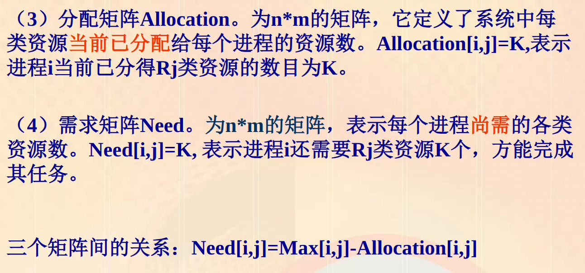
   > 
   > 
   > 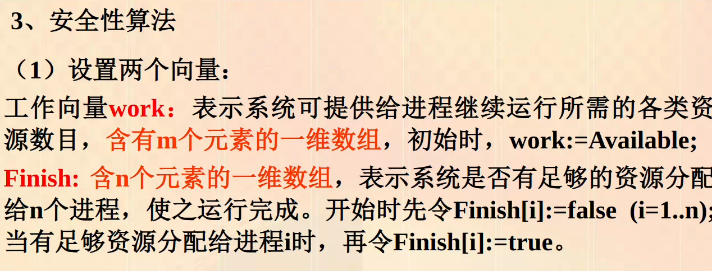
   > 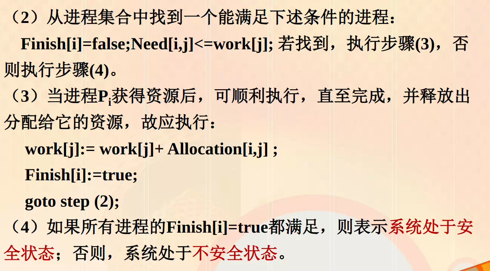
3. 死锁的检测：发生死锁时，OS需要检测出是否发生死锁
   1. 定义一个数据结构：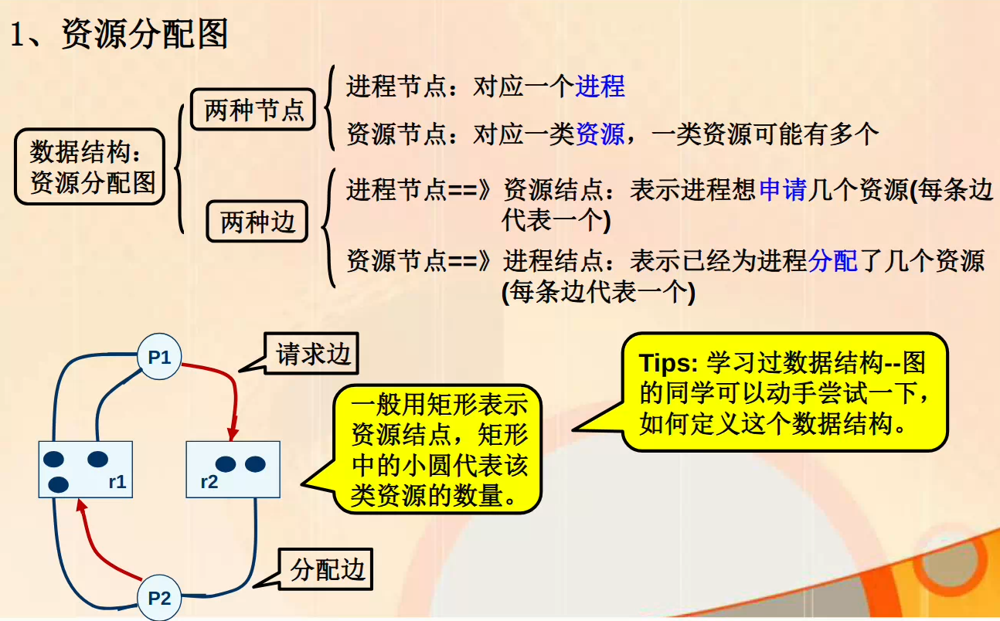
   2. 设计一个算法来检测死锁：对于请求边，尝试将请求满足，然后消除边（请求边）；若能够完成某个进程，则会将资源还掉，消除分配边，增加小球数量，然后又可能能够消除其他请求边。**若所有边都可以消除，则不存在死锁，即图是可以完全简化的**（相当于找到一个安全序列）。
   3. 检测算法(类似银行家)：
   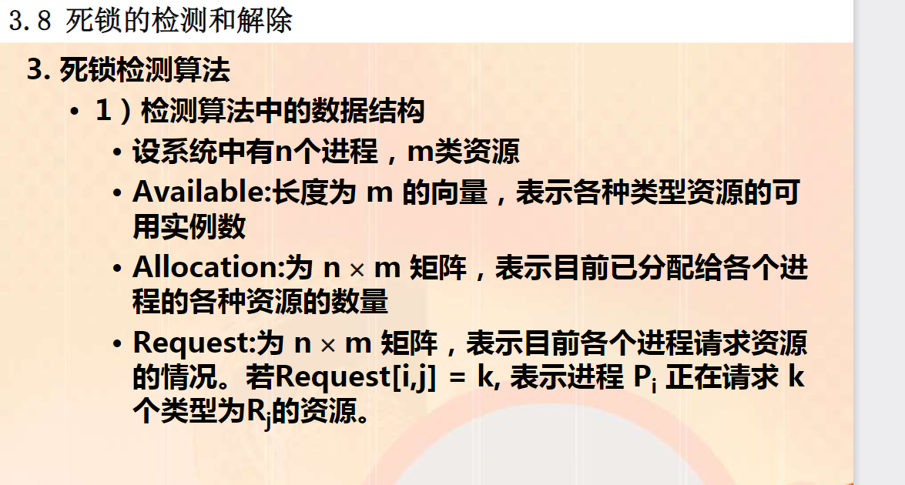
   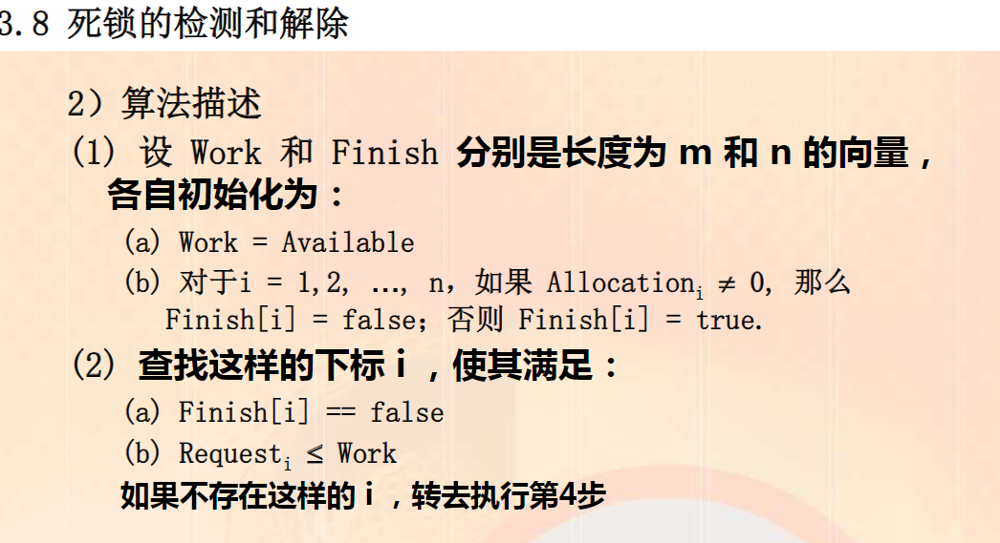
   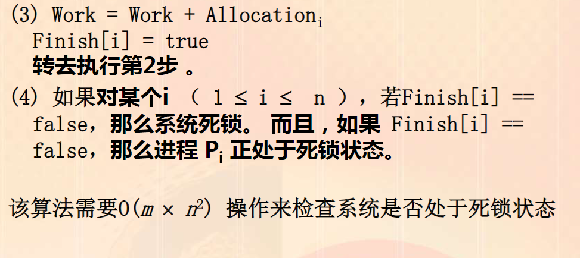
4. 解救死锁:
   1. *资源剥夺法*：将进程*直接挂起*，并剥夺资源给其他进程。选择进程时，要考虑代价最小，且不能总是让某个进程当牺牲品。注意不能让被挂起的进程长期得不到资源而饥饿。
   > 回滚(Roll-back)：*退回到安全状态并重启进程*；或者直接完全回滚，终止进程并重开。
   2. *撤销进程法*：直接终止部分或全部死锁进程。如何决定撤销？查看进程的优先级、已经消耗的资源数、运行时间等。
   3. *进程回退法*：将一个或多个死锁进程回退到安全状态。要求有历史记录。
## 死锁例题
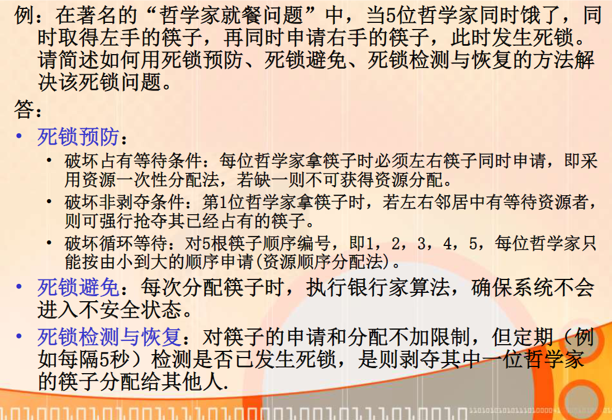

## 做题
1. 实时系统一般需要处理紧急事务，所以使用*抢占式优先级调度*
2. **绝对可抢占的算法：时间片轮转**，时间到必然被抢走
3. 当进程请求不到资源且有因为该资源而阻塞的进程时，*阻塞进程释放资源*可以避免死锁，但会导致**饥饿**。
4. 当资源分配图中：
   1. **没有环路**：破坏了循环等待，*一定不死锁*
5.  死锁定理用于检测死锁。
6. 银行家算法保证了**每个时刻都有至少一个安全序列，即每个时刻都至少有1个进程能获得所有需要的资源**
## 做题
1. 实时系统一般需要处理紧急事务，所以使用*抢占式优先级调度*
2. **绝对可抢占的算法：时间片轮转**，时间到必然被抢走
3. 当进程请求不到资源且有因为该资源而阻塞的进程时，*阻塞进程释放资源*可以避免死锁，但会导致**饥饿**。
4. 当资源分配图中：
   1. **没有环路**：破坏了循环等待，*一定不死锁*
5.  死锁定理用于检测死锁。
6. 银行家算法保证了**每个时刻都有至少一个安全序列，即每个时刻都至少有1个进程能获得所有需要的资源**

# 第4章 存储器管理
1. 存储器管理的功能：
   1. *存储分配和回收*：主要内容。讨论存储分配算法和数据结构。
   2. *地址变换*：可执行文件的链接技术、程序加载重定位、运行时地址变换等。
   3. *存储共享和保护*：数据共享和保护
   4. *存储器扩充*：存储器逻辑和物理组织
## 地址
1. 物理地址（实地址，绝对地址）空间：*硬件的地址空间*；逻辑地址空间（虚地址，相对地址）：*执行时程序看到的地址空间*。逻辑地址是CPU执行指令时生成的地址。
2. 将逻辑和物理地址分离，是存储器管理的核心。
   1. 程序编译阶段，是相对于加载地址的逻辑地址
   2. 程序加载阶段，是加载后的物理地址（加载地址+逻辑地址）
   2. 程序执行阶段，*逻辑地址和物理地址不同，使用地址映像机构进行***重定位**
## 程序和指令执行
程序从代码到执行过程为：`编写（代码）→编译（目标模块）→链接（装入模块）→装入（程序）`
1. 程序编译后，机器码所指定的地址是逻辑地址，是*相对于进程起始地址的相对地址*。在程序装载时，程序的起始地址不一定，必须要通过逻辑地址和物理地址的转换映像。
2. 装入模块：代码编译，链接后得到的可执行文件（elf、exe）等，由机器码组成。
3. 程序装入方式：
   1. *绝对装入*：**只适用于单道程序环境**。装入程序按照待装入程序的装入模块*绝对地址*装入。
   2. *静态重定位(可重定位装入)*:装入模块中指令给出的都是相对于程序起始地址0的相对地址。*当装入时，地址映像模块负责重定位，将相对地址转换为绝对地址*。无需硬件支持，可以装入有限多道程序。
   > 当*连续*内存不足以满足程序的全部内存要求时，无法装入；装入后不能再移动。
   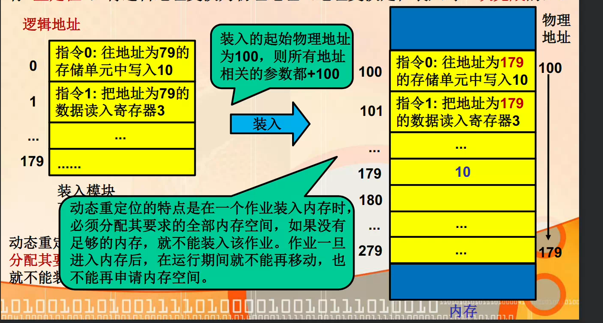
   3. *动态重定位（动态运行时装入）*：装入模块中存放逻辑地址，装入后仍然是逻辑地址，*当执行时动态执行地址转换，需要重定位寄存器（存放存入程序的起始地址）*。可以支持程序执行过程中的地址引用，例如地址指针。
   > 允许在执行时移动；可以分配给不连续的内存地址，给出*比存储空间大得多的地址空间*。
4. 程序编译：将高级语言代码编译为机器语言，得到多个*目标模块*
5. 程序链接：由链接程序将*多个目标模块和库函数*链接在一起，得到一个装入模块。
   1. *静态链接*：装入前将所有目标模块和库函数链接为一个装入模块后，之后不再拆开
   2. *装入时动态链接*：装入时，所有模块*边装入边链接*
   3. *运行时动态链接*：*运行时需要某个目标模块时*，才进行链接。便于修改更新，模块共享。便于局部代码修改，动态链接的dll便于适应运行环境
6. 地址生成：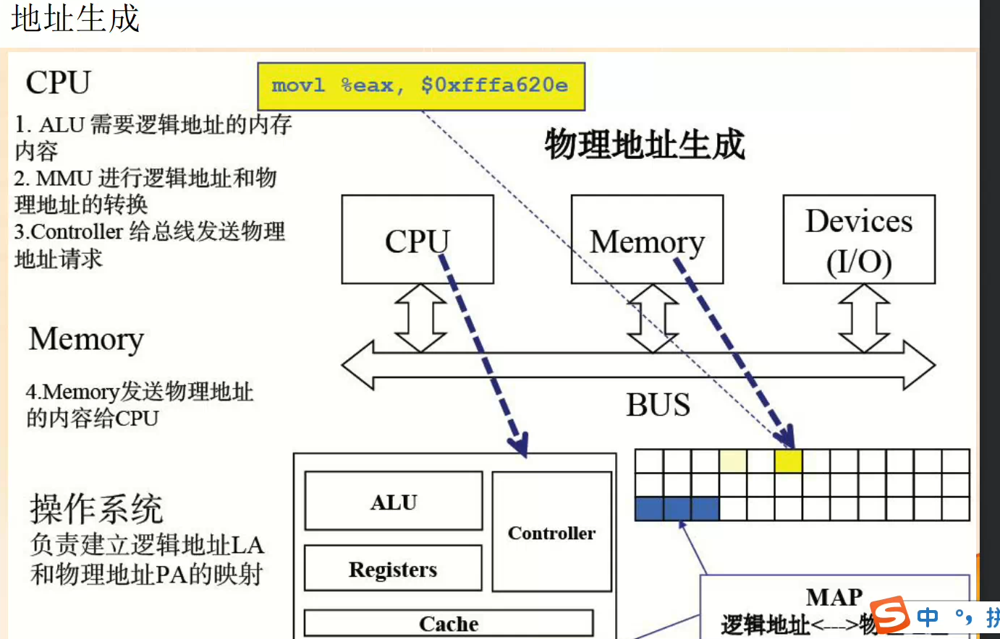
7. 地址安全检查：
   1. 逻辑地址空间由`base`和`limit`寄存器规定，设置这两个寄存器的指令是特权指令。
   2. 用户模式验证地址，发现危险地址则中断进入内核。
## 连续分配存储管理方式
连续分配：为用户程序分配一个连续的内存空间
##### *单一连续分配*
适用于*单用户、单任务的OS*。将内存分为系统和用户两部分，用户程序使用全部用户内存。没有存储保护。
##### *固定分区分配*
1. 分区式存储管理：为了实现多道程序系统，将内存分为相同（相同程序并发执行）或不同（根据程序大小分配）多个分区。os将分区按照大小排队，然后建立一张分区使用表：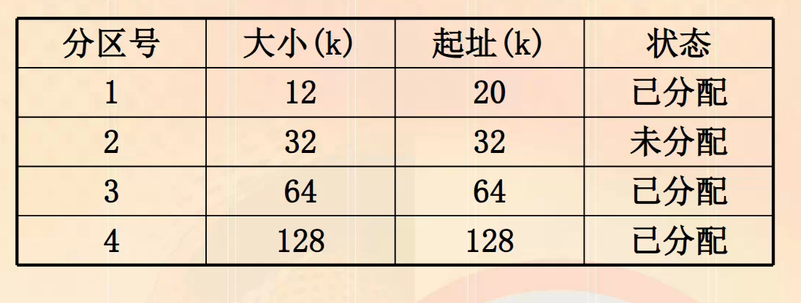
2. 系统用一个，剩下的用户使用。 
3. *内碎片：占用分区之内未被使用的空间（分区大了）；
4. *外碎片*：分区中难以利用的空闲分区（小分区没人够用）*
##### *动态分区分配*
1. 当程序运行时，os根据进程的实际需要分配内存块（分区）。os持续追踪运行时的已分配内存块和空闲块。
2. 为了管理空闲分区建立了*空闲分区表*或*空闲分区链表*，动态改变，可划分为空闲分区表和占用分区表。
空闲分区表：
空闲分区链：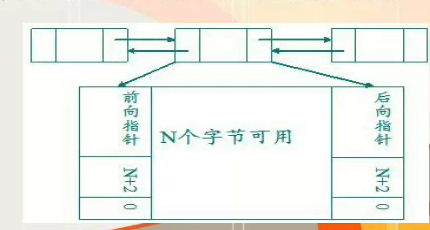
占用分区表：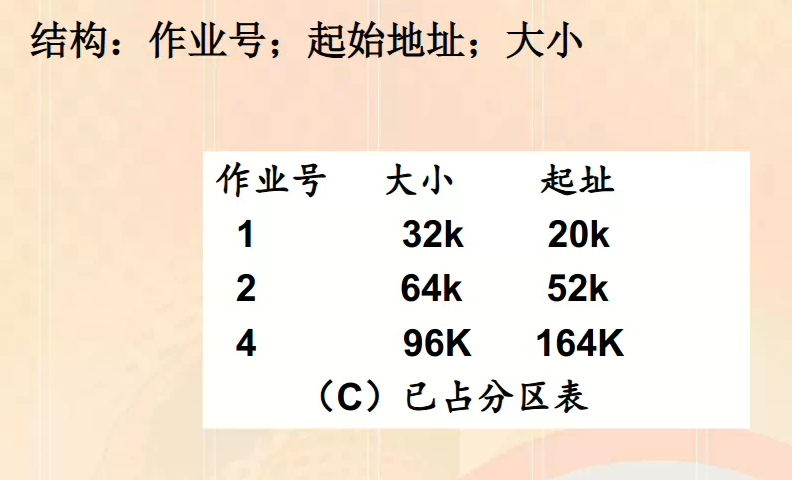
3. 分区分配算法：
   1. 当一个进程需要装入，则寻找一个空闲块，大于等于需要大小
   2. 若大于，则将块划分为两个块，一个大小=需要，剩余块空闲
   3. *首次适应算法（first-fit）*：按照分区先后次序，找到第一个适合的空闲块。分配释放速度快，可以将大块留在高地址。然而随着小块增加，*查找时间增加*。
   4. *循环首次适应算法、下次适应法(next-fit)*：设置一个起始查找指针。每次都从上一次查找成功的地址开始找，找到第一个合适空闲块。分配释放速度块，不易保留大块。
   5. *最佳适应法(best-fit)*：从小到大排序空闲块，*找到和需求差距最小的空闲块*。外碎片小而多，大空闲分区可以保留。
   6. *最坏适应法(worst-fit)*：从大到小排序空闲块，*每次分配最大空闲块*。基本不留小空闲分区，但不保留大空闲分区。
   7. *快速适应算法(分类搜索法)*：将分区按照大小分类，同类分区大小相同，建立多个空闲分区链表；系统中建立管理索引表，记录多类分区表头。查询空闲分区效率高，释放慢。

4. 分区分配操作：
   1. 分配内存
   2. 回收内存：
   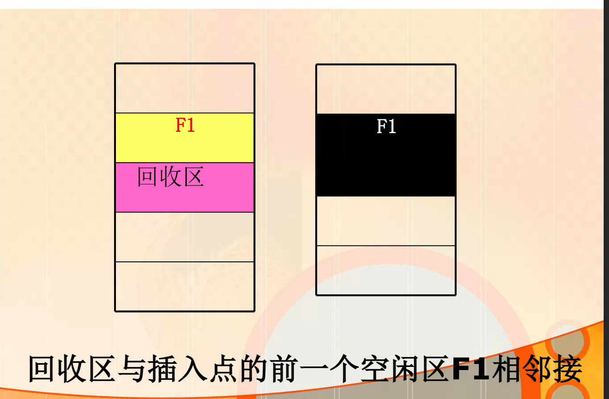
   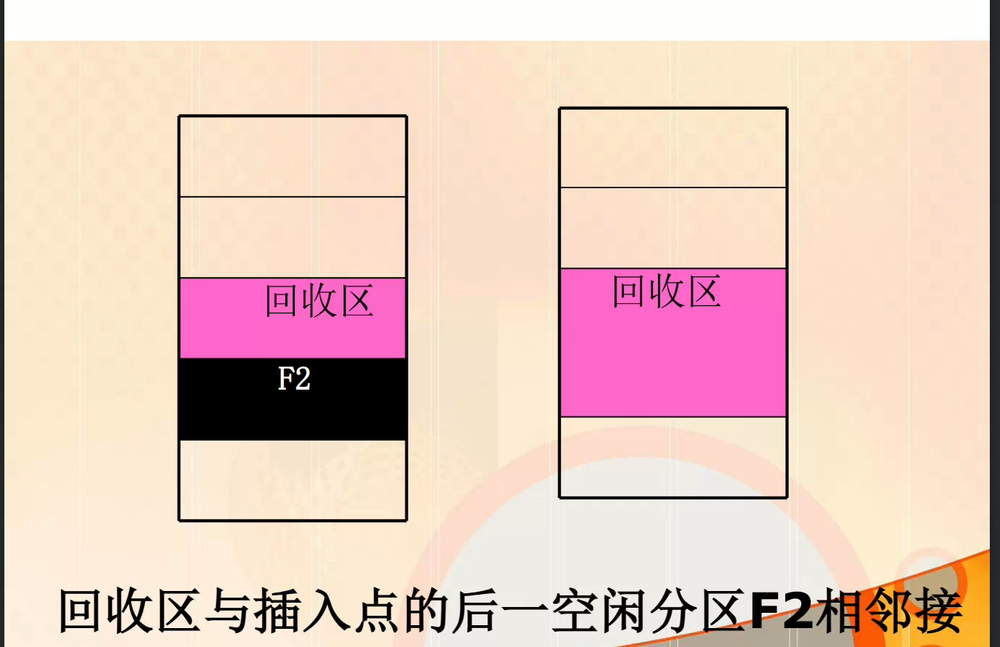
   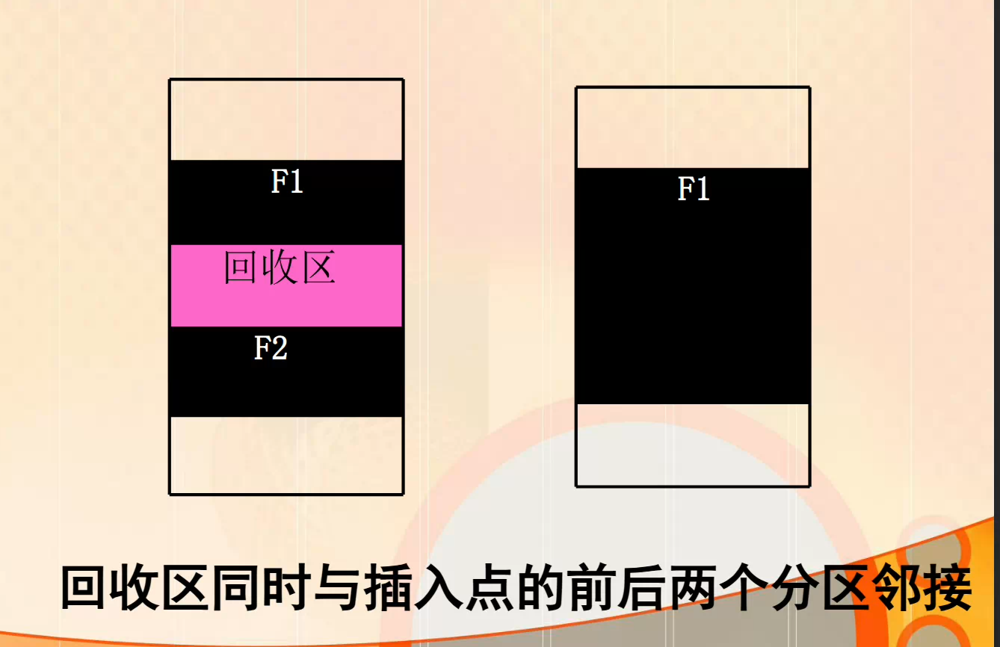
##### 伙伴系统
动态分区方式和固定分区方式的折中。
1. 所有分区大小都固定为$2^k$，其中$1\leq k \leq m$。$2^m$为整个存储器大小。、
2. 
3. 搜索速度快，外部碎片少，但是有较大内部碎片
##### 可重定位分区分配
外部碎片大小总和可能已经超过了需求大小，但每个单独分区都不够。
1. 紧凑(compaction)：
   1. 将各个占用分区向一端移动，空出来较大的空闲空间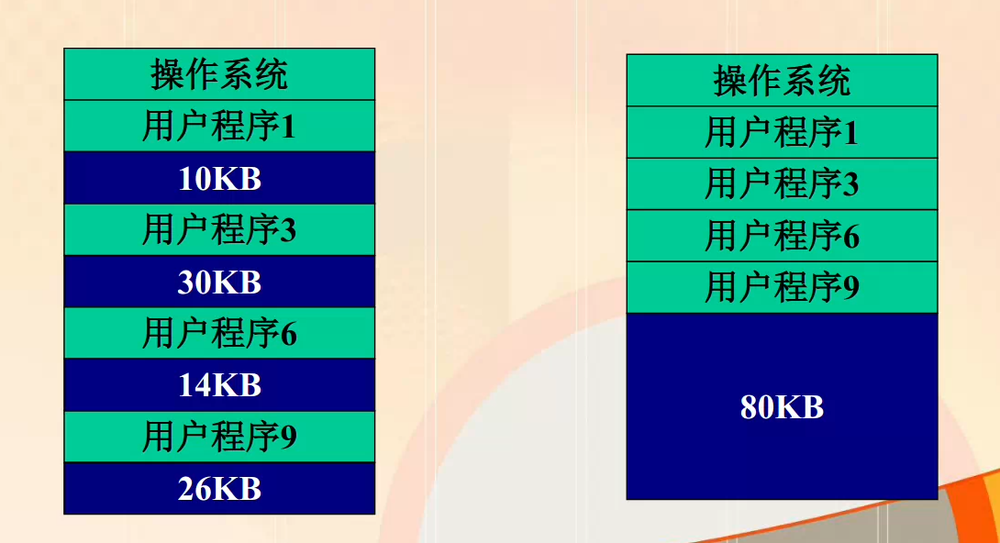
   2. 移动会占用CPU时间，且需要额外硬件支持（重定位寄存器）
   3. 何时执行紧凑操作：每个分区释放后，或内存分配找不到满足条件的空闲分区时
   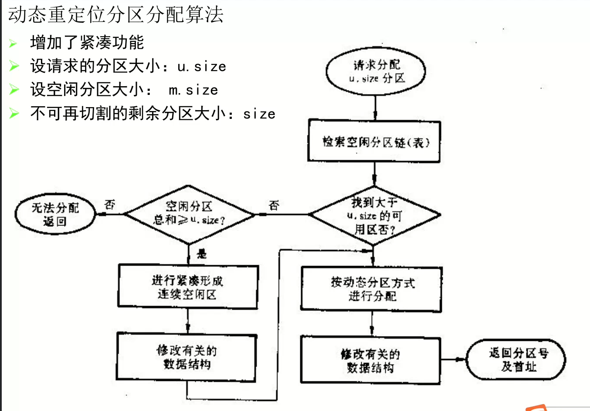
2. 覆盖：目标是*在较小的可用内存中运行较大的程序*。常用于*多道程序系统*，与**固定分区存储管理**配合使用
   1. 将程序的重要常用模块常驻内存中；不常用模块放置在外存中，用到时才装入内存进行覆盖。不存在调用关系的模块没必要同时装入。
   2. 时间换空间，覆盖耗时；且编程时需要划分模块。
   3. **同一进程内**，只能覆盖与当前代码段无关的代码。
3. 对换(swapping，滚进，滚出)：
   1. 将主存中*暂时不能运行（阻塞、低优先级）的进程对换到外存*，腾出空闲空间来防止可以运行的进程或进程需要的数据等资源。
   2. 交换单位是*进程的整个地址空间*
   3. 外存被分为对换区和文件区，为了加快对换速度，os采用连续存储方式，少考虑碎片。
   4. *换出*:当前执行进程需要更多内存、创建了高优先级进程而内存不够时，os将阻塞态的低优先级进程传送至外村对换区；
   5. *换入*：内存空闲时，os将就绪且换出时间最久的进程传送至主存
   6. 可以增大并发数量，增大吞吐率；而对换过程耗时，且不考虑进程访问内存的统计特征。
   7. *不同进程间*
## 基本分页存储管理方式 
**离散地分配，基本单位是页**，不支持虚存技术，要求把整个作业都装入内存，才能运行。
1. 物理内存被划分为*固定大小（出厂设置）*的页框(page frame，物理页框，页帧)。进程的逻辑地址也被划分为多个页。
2. *逻辑地址映像*需要硬件（页表寄存器）支持。
3. 进程装入时寻找空闲页框（*不必连续*），进程每个页占据一个页框。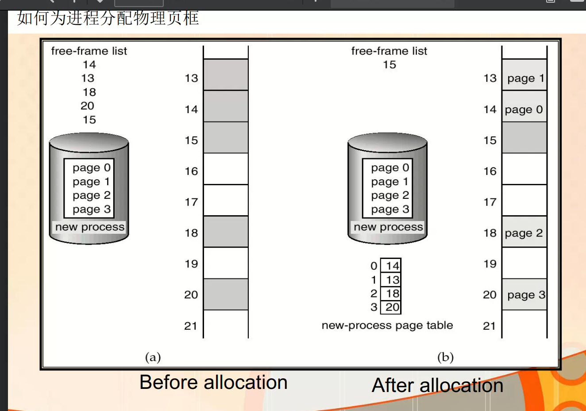
4. 小页减少内碎片，但增大管理开销；大页相反。
5. 没有外碎片，内碎片小，程序不用顺序存放。但必须将整个程序都装入内存。
### 基本分页管理中的数据结构
1. *物理页面表*：整个系统有一个，写明了*所有物理页框的分配使用情况*
2. *进程页表*：进程中的页表，写明了*进程中每页占用的物理页框号*。
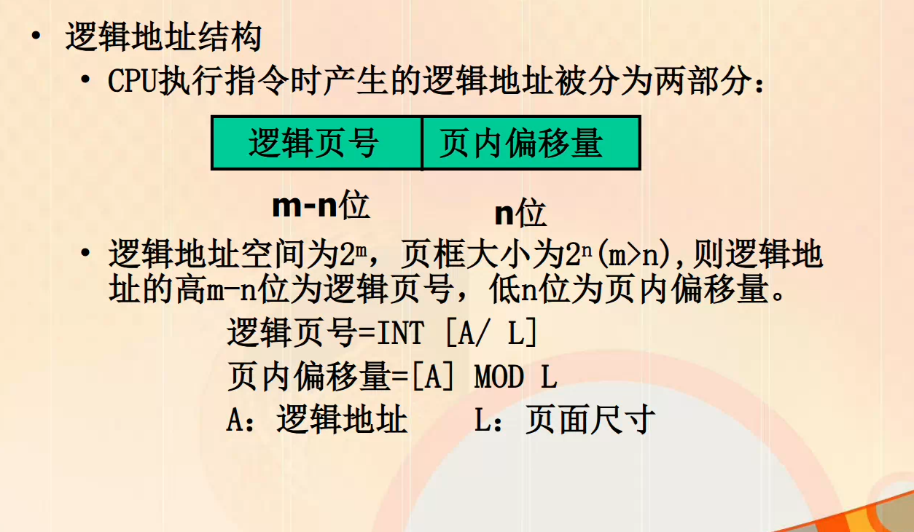
3. *请求表*：整个系统一个，写明了*各个进程的进程页表位置和大小*，也可以放入PCB中，加载到页表寄存器后可以用于*物理地址映射*
### 地址变换机构
1. 逻辑地址给出*逻辑页号，页内偏移*；查询进程页表可以找到对应的*物理页号*，通过业内偏移找到实际地址。
2. 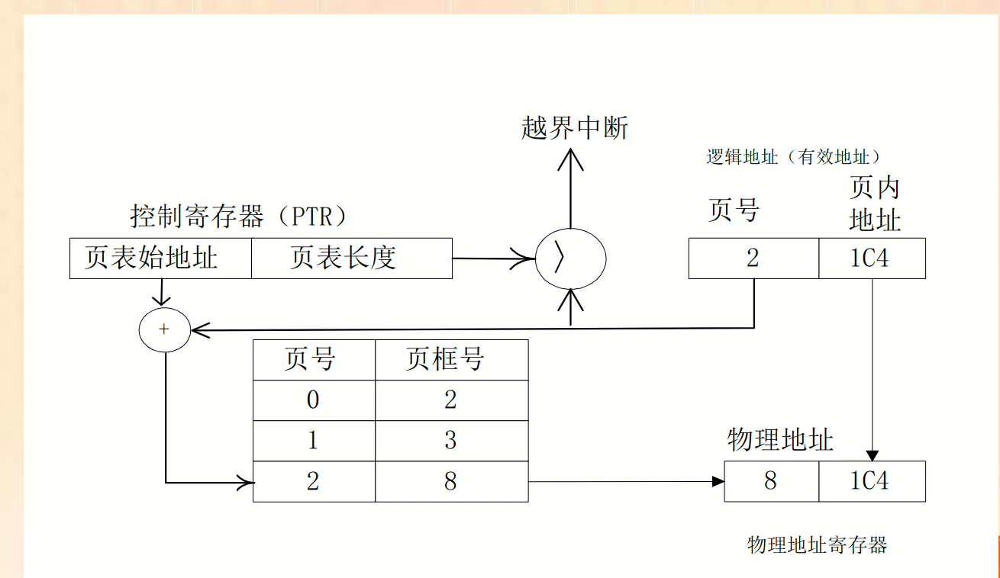
##### 两级页表和多级页表
即页表的页表。PCB中存放进程页的页目录表所在位置的物理页框号。
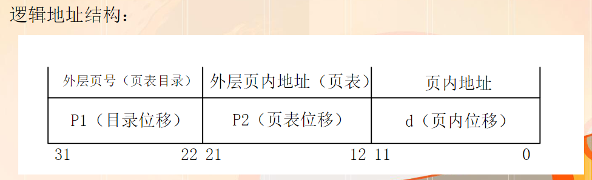

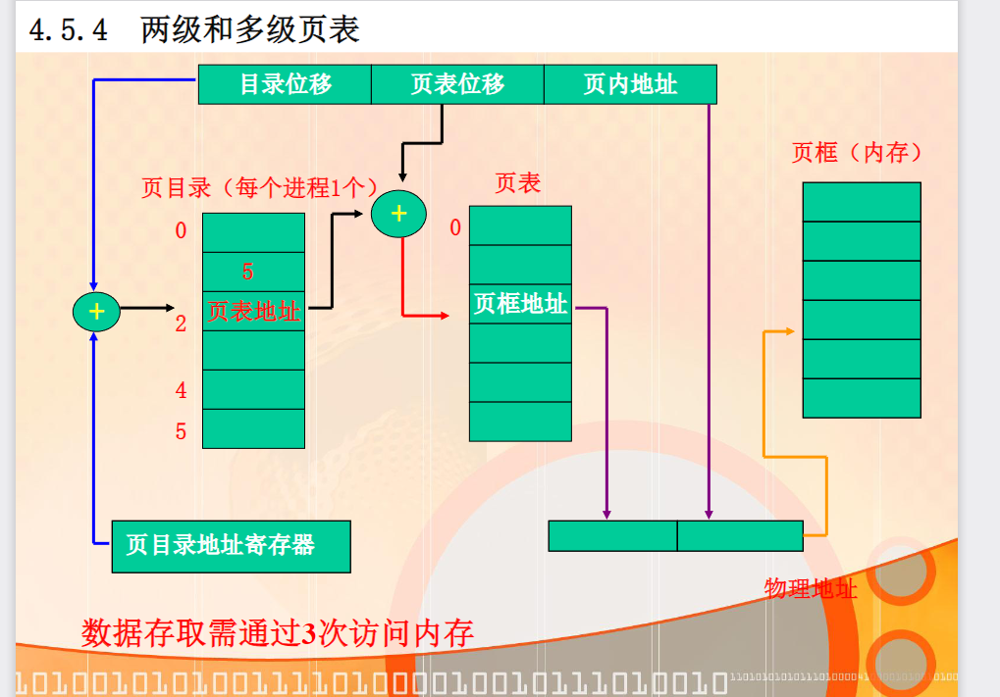
##### 反置页表
正常的页表:每个进程都拥有一个
|页号|物理页框号|
|-|-|
|...|...|

反置页表按物理块号的顺序排序，内容为隶属的进程id及其页号
|物理页框号|进程pid|进程内页号|
|-|-|-|
|...|...|...|

实际上可利用联想存储器来检索。
这样就只有一张表，但检索耗时比较长，可能需要查询整张表，不利于**页面共享**
##### 快表
1. 一般的页表装在内存中，一次取址操作需要两次访存（一次读表一次读地址）。*若将页表放入寄存器中就会快很多。*
2. 联想存储器：具有并行查找功能的高速缓冲寄存器，根据*程序局部性原理*，将页表的几个表项存储起来，一般为8-32个。
3. 访存时首先查找快表，若命中，则直接产生物理地址。只需访存一次。
4. 若快表不命中，则查找内存里的页表，并按照一定的置换算法，置换快表中的页表项。生成物理地址，此时要访存两次。

### 页面共享
经常在页面分配时需要一些连续的页框。然而不同页面大小需求会申请到不同位置不同大小的页框，导致存在很多**小的空闲页框**，属于碎片，难以被分配。Linux内核解决方法：*引入伙伴系统*，将所有页框分为多个连续的1、2、4、8、...、1024个连续页框组成的页框块，页框块的第一个页框物理地址是页框块大小的整数倍。
## 基本分段方法
分页方法提高内存利用率，**对程序员透明**。
分段方法用户编程更方便，程序的可读性更高,*满足了程序员实际的变成需求*，将程序地址空间划分为若干个段(segment)、加载时，分配所有段（内存分区），**各段不必连续**；物理内存的管理采用**动态分区**。需要CPU的硬件支持。 
1. 分段方式和优点：
   1. 将程序划分为多个段（拥有段名：代码段、数据段、共享段；编译程序会将段名转换为段号），**每个段逻辑地址都从0开始**，可以分别编写和编译。每个段装入内存时必须连续，但段之间不必连续。
   2. 易共享：以段为单位便于共享，而页不便
   3. 分段保护：对于不同的段给出不同保护机制
   4. 动态链接：动态加载时只需要装入需要的段，其余段用到时再链接。
   5. 动态增长：数据段可能随着执行增大。
   6. 优点是没有内碎片，外碎片也可以通过紧凑技术去除。缺点是必须将整个进程装入内存。
2. *逻辑地址*组成：|段号(决定程序分段数量)|段内偏移(决定一个段大小)|
3. 段表：每个进程的段号对应的物理地址，一个段对应一个段表项，**每个表项大小相同**，需要表达**最大段长度+整个地址空间**。例如一个逻辑地址为16位段号+16位段偏移，则最大段长度16位。若是4GB(32位)的内存，则为了表示基地址就需要32位，表项一共16+32=48位。

|段号|段大小|基址|
|-|-|-|
|0|10K|80K|
4. 段表查询方法: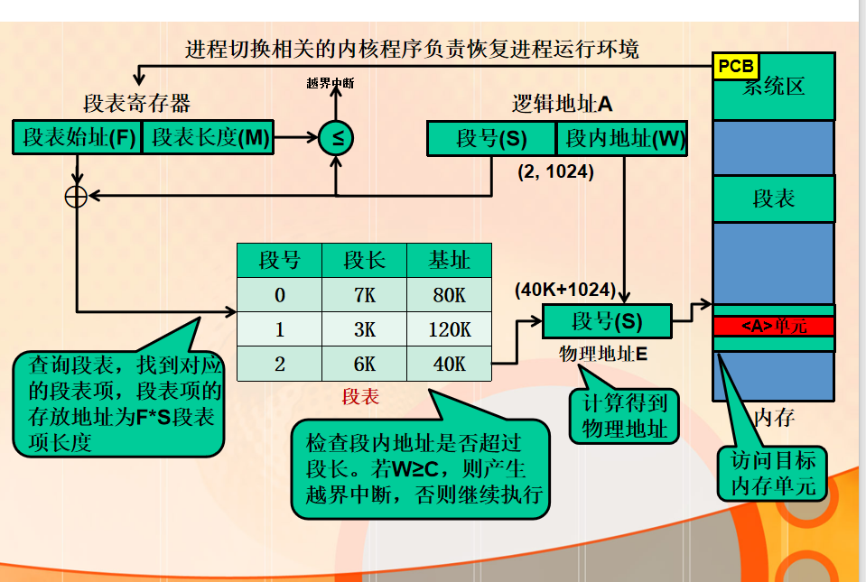
### 分页、分段的对比
1. 页是信息的*物理单位*，为了提高内存利用率，实现离散分配，属于系统行为，*用户不可见*。地址空间是一维的，只需给出一个标记符（逻辑地址）就能表示出一段物理地址。一个页大小固定。
2. 段是信息的*逻辑单位*，为了给出逻辑信息，对用户可见。地址空间二维，需要段名和偏移才能表示一段物理地址。
3. 分段比分页*更能实现数据共享和保护*。对于不改变的代码（没有可能导致数据不一致的变量，可重用等，例如单纯输出Hello World的代码），称为纯代码/可重入代码，**可以让多个需要该代码的进程段表指向同一个段**。一个段大小不固定，但通常比页大，段表更小，查询效率更高。
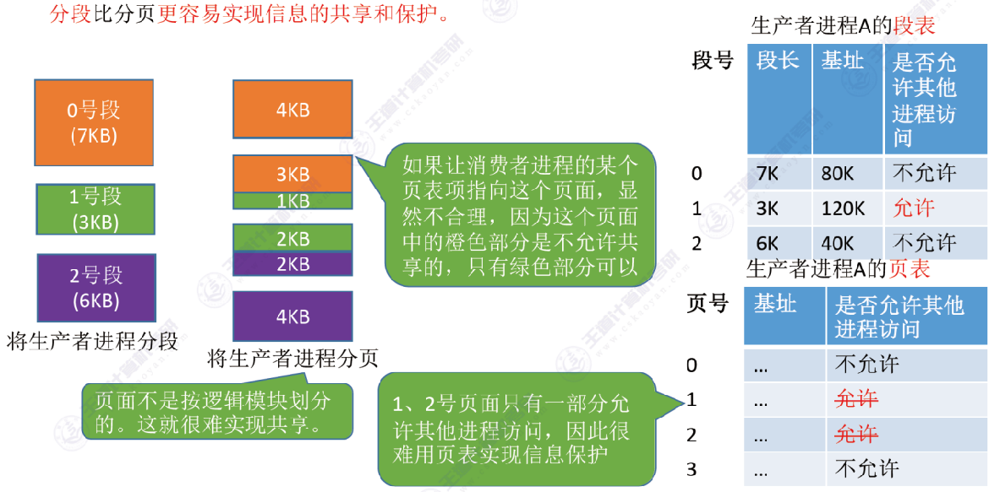
4. 页没有逻辑性，所以一条指令或一个操作数可能跨越页，但绝不会跨越段。
### 信息共享
能共享的代码必须是可重入代码（纯代码），允许多个进程同时访问，执行过程中**不能有任何改变**。
1. 能调用纯代码的进程都有自己的**局部数据区**，要将可能在执行过程中改变的数据放入局部数据区.
## 段页式方法
**将代码分段，再将段分页**。
1. 逻辑地址：**|段号|段内偏移|**；之后，地址变换机构将二维地址变为三维 **|段号|段内页号|页偏移|**。二维的段号+段内偏移是程序员可见的，所以**地址维度仍然是二维**。
2. 表：
   1. 每个进程一个段表，给出 |段号|页表大小|页表首地址|；每个段给出一个页表，给出 |页号|页框号|
   2. 存在一个段寄存器，给出|段表首地址|段表项大小|
   3. 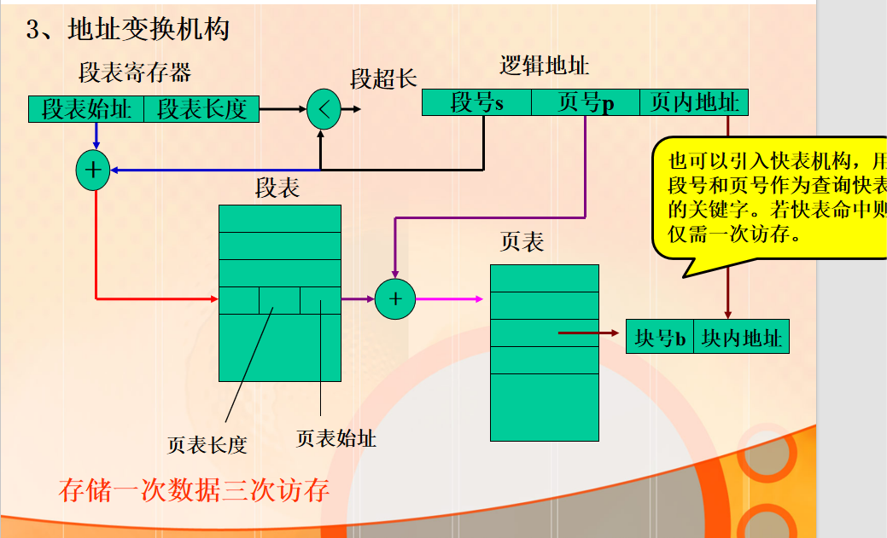
## 总结
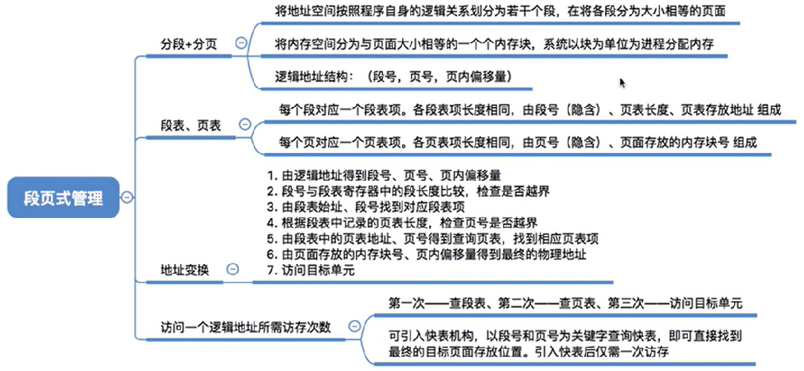
# 第五章 虚拟存储器
存储器管理中，多种管理方式都要求**将整个作业放入内存**。然而当作业大于内存总量或多个作业等待装入内存时，不够。引入虚拟内存。
1. 常规存储管理方式的特征：
   1. 一次性：以覆盖的方式，将作业一次性装入内存，作业不能大于内存。
   2. 程序的驻留性：装入内存便驻留内存，阻塞时也在内存。但装入内存的程序和数据不一定马上使用
2. 虚拟存储器定义：
   1. 虚拟存储器是指**具有请求调入和置换功能**，从逻辑上对内存容量加以扩充的一种存储器系统。
   2. 借助外存，允许程序部分装入内存。
   3. 虚拟地址空间的大小由指令的寻址空间决定。但进程实际尺寸（代码、数据）不能超过物理内存与外存之和。
   4. 用于透明。
3. 虚拟存储器工作过程：
   1. 程序执行前，只需要将需要的*部分页*装入内存，就可以执行。
   2. 执行过程中，遇到需要的指令或数据不在内存中（即**缺页/缺段**），处理器通知操作系统将相应页调回内存，继续执行。
   3. 若当前内存已满，则将暂时不用（挂起等）的页和段放入外存。具有请求调入和置换功能
4. 引入虚拟存储技术的好处：
   1. 可以在小内存中执行大需求内存的进程。
   2. 内存容纳更多进程并发执行。
   3. 不影响编程时的程序结构
   4. 用户可用的虚拟内存空间通常大于物理内存
## 虚拟存储器的引入
1. **程序局部性原理**:
   1. 时间局部性：一个数据/指令被使用的时间段集中。（循环结构）
   2. 空间局部性：程序一段时间内访问的地址集中。（循序执行）
2. 虚拟存储实现**基于离散分配存储**管理方式，不可以使用连续分配存储。分页请求系统、请求分段系统。
3. 特点：
   1. 多次性：一个作业分多次调入运行
   2. 对换性：允许将暂时不用的段/页调换到外存，需要时再调换回内存
   3. 虚拟性：逻辑地址空间大于实际物理空间
   4. 离散性：物理地址空间不连续
   5. 调入和调出是对部分虚拟地址空间进行的
### 请求分页系统
页式虚拟存储器：纯分页系统+请求调页+页面置换，增加请求调页和页面置换功能，*每次调入调出都是长度相同的页*，最常用的方式。
1. 硬件支持：
   1. 请求分页的页表：纯分页的页表增加若干项
   2. 缺页中断
   3. 地址变换机构
2. 实现请求分页的软件
   1. 请求调页的软件
   2. 页面置换的软件
3. 新的页表：
   1. 操作系统需要知道*每个页面是否已经调入内存*，未调入的需要知道页面在外存的地址。
   2. 内存不够时，发生**页面置换**。操作系统需要按照某个指标*选择调出哪个页面*。当内存中页面被修改过，则需要覆盖外存页面内容。所以需要*记录每个页面是否被修改*
   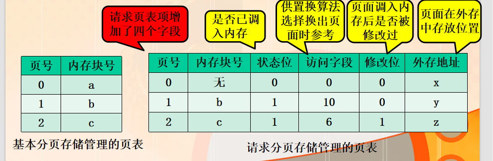
4. 缺页中断机构：
   1. 某进程访问的页面不在内存时，*发生缺页中断*。缺页中断机构来处理，将缺页进程阻塞，调页完成后再唤醒。
   2. 若内存中存在空闲块，则为进程*分配一个块*，将缺的页放入块中，修改页表项；若内存中不存在空闲块，则*由页面置换算法选择一个页面淘汰*，若该页面修改过（称为脏页面），需要重新写入外存；否则不用。
##### 硬件支持
缺页中断属于内中断。**一条指令可能发生多次缺页中断**。
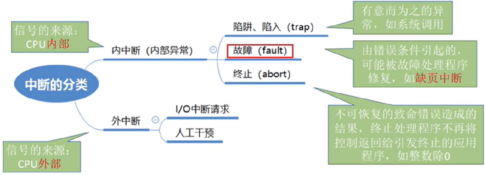
1. 缺页中断机构：每当进程缺页，则自陷，产生缺页中断，使用操作系统提供的中断处理程序来处理。 如果在指令执行中途发生中断，*则缺页处理后需要重新执行当前指令*。
2. 与基本分页存储管理区别：
   1. 增加请求页面：缺页时中断，请求页面
   2. 增加页面置换：当内存没有空间时，调换
   3. 增加对页面表中新增表项的修改
3. **快表中有的页面一定在内存中，当某个页面被调出到外存，则在快表中被删除**
4. 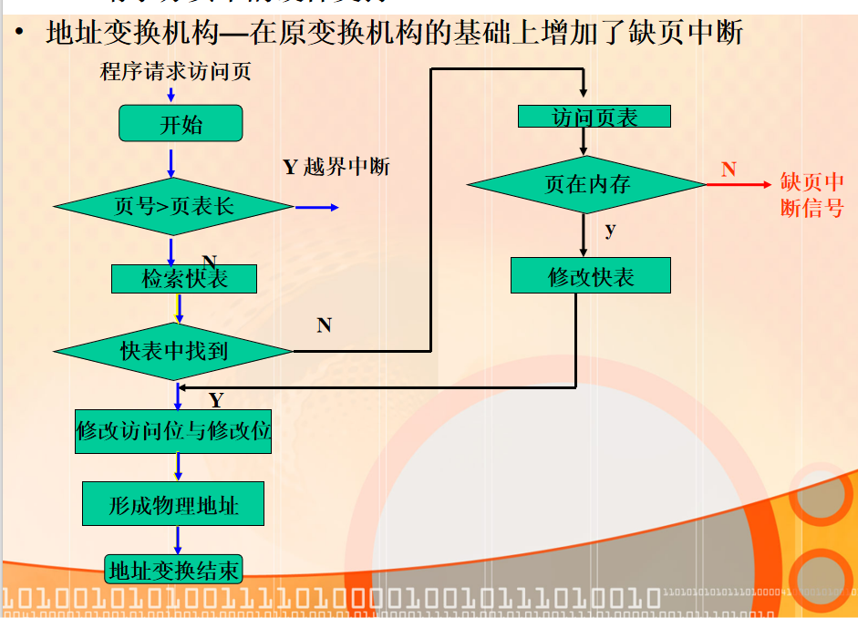
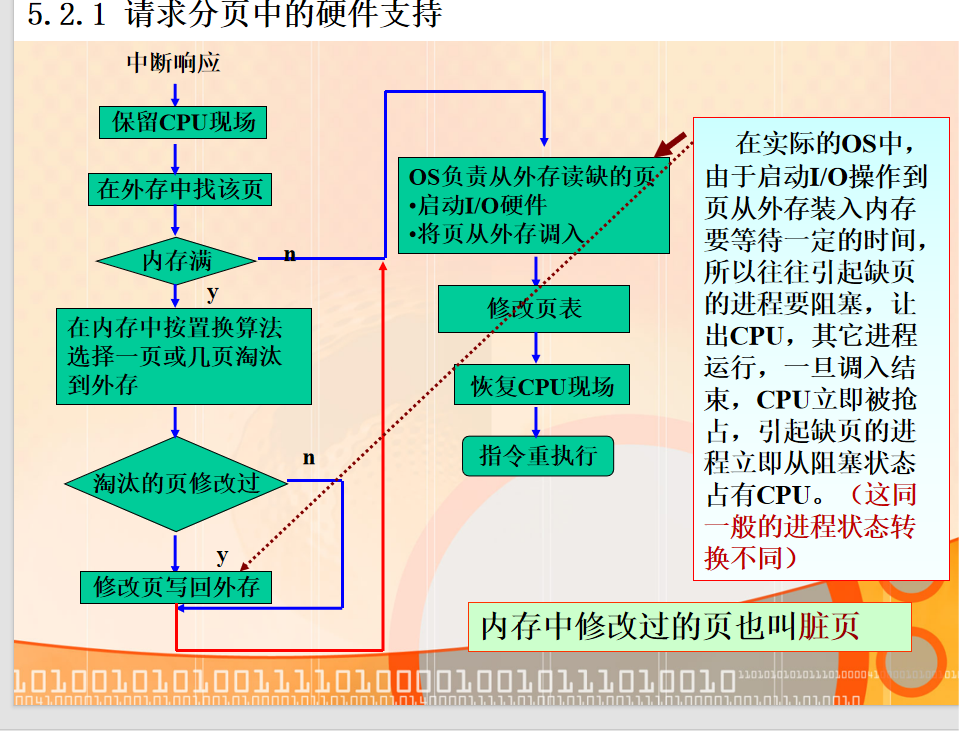
##### 内存分配算法
1. 为每个进程分配内存时，涉及三个问题：最小物理块数的确定、物理块的分配策略、物理块的分配算法。目的：*减少缺页中断*
2. 最小物理块数的确定：os需要确定进程需要的最小物理块数，过小则频繁缺页中断。
   1. 单地址、直接寻址：2个页面；间接寻址：3个页面；swap(A,B)，swap、A、B均跨越两个页面
   2. *固定分配局部置换*：每个进程分配*固定页面数*，置换时只置换出该进程页框的旧页面。
   3. *可变分配全局置换*：最易实现。*预分配一定量页框，os准备一定量空闲页框*。缺页中断时分配一个空闲页框，空闲页框用完时从某个进程抽出一个页框。可能会不公平。
   4. *可变分配局部置换*：预分配一定量页框，os准备一定量空闲页框。缺页中断时首先考虑从当前进程页框中调出旧页面。*若频繁发生缺页中断，才考虑给予新页框*。统计中断率有系统开销。
##### 物理块分配算法
1. 平均分配：将总物理页框平均分配给每个进程
2. 按比例分配：
3. 按优先权分配
##### 页面调入策略
1. 不同调页方式：
   1. 预调页：每次缺页中断调入*缺的页和相邻的多个页*，成功率50%。IO效率高（基于预测，可能效率低），多用于进程装入时调页。
   2. 请求调页：只调入缺的页。容易实现，但外存I/O次数多，要求IO速度快。
2. 从何处调入页面：
   1. **将外存和内存分为文件区和交换区，通常交换区IO效率更高**。
   2. 策略1：进程运行前，*全部页面调入交换区*，以后总是从交换区调入调出。要求交换区空间大
   2. 策略2：*不会或未被修改的*，直接从文件区调入，调出无需覆盖。*会被修改的页面*，调出到交换区，以后从交换区调入。
   3. 策略3：UNIX方式。未运行过的页面从文件区调入。运行过的调出到交换区，以后从交换区调入。进程结束时，更新文件区内容
##### 页面置换算法 
物理内存满时，需要选择内存中哪个物理页面置换。
1. 目标：*降低缺页中断频率*。根据程序局部性原理，对历史统计数据进行预测，调出不再常用的页面。反之出现“抖动”
2. 页面锁定：os关键进程或时间关键的应用进程不能被调出，**添加锁定标志**。
3. *最佳置换算法*（OPT，Optimal）:选择“当前不再使用”或“最长时间不再使用”页面置换
   1. 操作系统无法提前预判页面访问序列，是**理想情况**，只用作性能评价的依据。对于需要的页面号，计算内存中页面号与之的距离，调出最远的页面。
   2. **当内存未满时，不需要置换**
   3. 可以保证最低缺页率。
4. **先进先出（FIFO）**：置换掉最早建立的页面。通过链表或队列表示建立过程。
   1. 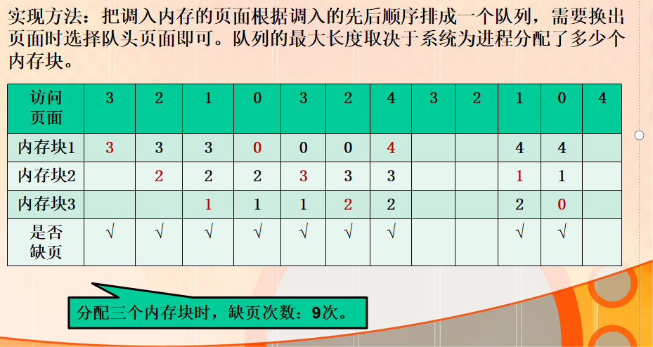
   2. 然而，最早建立的页*可能是最常访问的页*，FIFO下会频繁调入调出。算法性能较差，有Belady现象。
   3. **Belady**现象：系统分配给进程的内存块增加后，**缺页次数不减反增**。**只有FIFO存在Belady**。原因：FIFO置换特征与进程访问内存的动态特征矛盾，*置换出的页面不一定是不使用的*。
5. **最近最久未使用LRU**算法：
   1. 算法性能好，但实现困难，需要特殊硬件支持。
   2. *将最近最久未使用的页面调出*（局部性原理的合理近似）。使用页表中的**访问字段**来记录某个页*自上次使用到现在的时间t*。调出时选取t值最大的。
   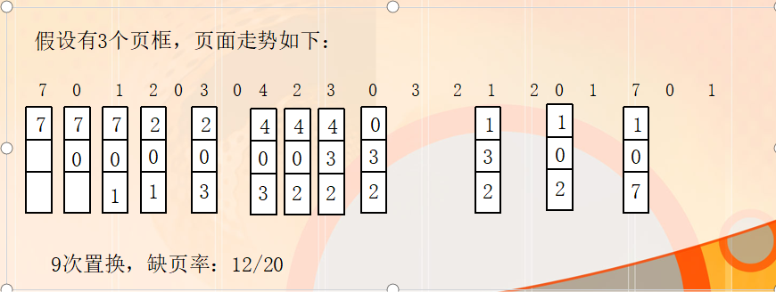
   3. LRU硬件支持：硬件机构来记录
   > 1. 一个特殊的*栈*，每次页面被访问时，将该页面**移动至栈顶**，此时栈底的页面就是t值最大的页面。
   > 2. 每个页面设置移位寄存器，被访问时左移一位；定期右移并高位补0，哪个页面寄存器值最小谁就是t最大的。
6. 为了避免硬件实现，实际采用**LRU近似算法**:
   1. CLOCK算法也称*最近未使用算法*(**NRU**, Not Recently Used)或二次机会算法，它是LRU和FIFO的折衷。
   2. CLOCK：每个页面设置一个*访问位*；内存中的页面通过链接指针形成*循环队列*。页面被访问置1。置换时，若为0则置换；为1则置为0，继续向后检查。若整个一轮全是1，则执行第二轮扫描，**最多扫描两遍就能成功置换。**
   3. 改进型的时钟置换算法：**只有页面被修改过，才写入外存，最好是优先选择没有被修改过的页面进行置换。**增加一个*修改位*，有(访问位A，修改位M)。进行扫描：
   > 1. 第一轮，扫描(0,0)，并置换。若没有，开始第二轮。
   > 2. 第二轮，扫描(0,1)，并置换。此时将所有*扫描过的页面访问位A设置为0*
   > 3. 第三轮，扫描(0,0)，并置换。
   > 4. 第四轮，扫描(0,1)，并置换。
   > **最多四轮**。
7. 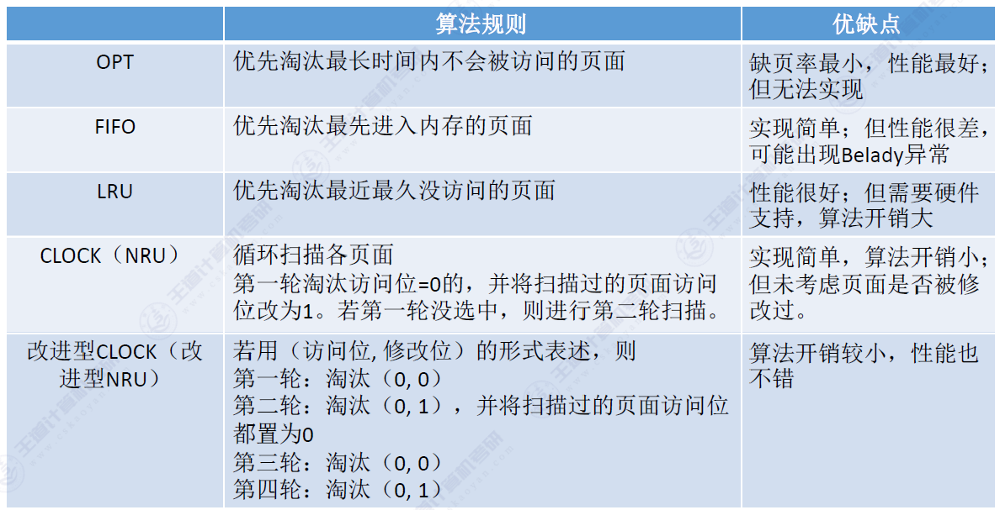
8. 最少使用（Least Frequently Used）置换算法--最不常用算法(NFU):选择到当前为止**访问次数最少**的页面。每个页面设置计数器，每当页面被访问，则计数器+1。缺页中断时，淘汰计数最小的。
9. 页面缓冲算法（Page Buffering）：FIFO的发展。
   1. 设置空闲页面链表，已修改页面链表
   2. FIFO选择一个被置换页，若被修改则放入已修改链表尾；否则放入空闲页面链表。
   3. 调入新物理页面时，将新页面内容读入到空闲页面链表的第一项，然后将第一项删除。
   4. 空闲、已修改页面会停留在内存中一段时间。*当空闲页面被再次访问时，可以以较小开销置换回去*。若未命中，则将空闲链表第一项置换掉。
   5. 若已修改数量到达一定阈值，则统一调出到外存，大大减少IO次数。
##### 请求分页系统的性能分析 
1. 缺页率对*有效访问时间*的影响：
   1. 设ma为主存的访问时间，约为100ns，缺页率为 P
   2. 有效访问时间=（1-P）*ma + P*缺页中断时间
   3. 缺页中断时间计算：缺页中断服务时间（<1ms）+读入新页时间（24ms）+进程重执行时间(<1ms)。**磁盘速度和接口性能很重要*
   *
2. 磁盘访问时间与页面大小：
   1. 磁盘访问时间 =  *寻道时间+旋转等待时间+读写时间*
   2. 采用较大的页面，相应交换区中由多个连续磁盘扇区组成存储单位，可以提高从交换区调页的I/O效率
##### 抖动与工作集
1. 缺页率：缺页次数/内存访问次数。随着物理内存分配的大小增大而降低,但随着内存增多，缺页率下降程度降低，存在拐点
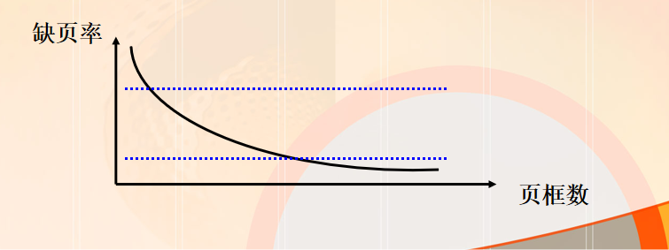
2. 工作集:程序运行时对页面的访问是不均匀的，即局部性原理.
   1. 工作集是在某段时间间隔$\Delta$里，进程实际要访问页面的集合
   2. 用一个二元函数$W(t, \Delta)$表示，其中$t$表示执行时刻，$\Delta$是窗口大小，是虚拟时间段（阻塞不计时的时间段），大致可以用执行的指令数目，或处理器执行时间来计算。
   3. 工作集包含了$[t - \Delta,t]$时间内的所有访问页面，$W(t,\Delta)$指工作集大小即页面数目
   4. 
3. 工作集性质：
   1. $W(t, \Delta)$随着$\Delta$单调递增
   2. 程序开始执行时，随着新页面访问，逐步建立起稳定的工作集，$W(t, \Delta)$趋于稳定。*当局部变换时*，快速扩张或收缩，之后继续稳定。
   3. 引入目的是：依据进程在过去的一段时间内访问的页面来调整进程分配到的物理页框数目。
4. 工作集动态调整多道程序调度：
   1. os跟踪工作集，为其分配*大于工作集需要帧数的帧数*。若有空闲帧，则启动另外一个进程。
   2. 若没有空闲帧，则os选择一个进程挂起。
   3. 防止了抖动，提高了多道程序的并发度
5. 工作集实现的困难：
   1. 工作集过去的变化*未必能够成功预测未来工作集*。
   2. 记录工作集变化开销大。
   3. $\Delta$难以优化，且经常变动。
6. *抖动是什么及其产生原因*：
   1. 内存中进程增多，即并发度增高时，处理器利用率先增后减。
   2. 这是因为*每个进程的物理页框数减少*，缺页率上升，大部分时间用于页面置换，几乎不能完成任何工作，称为抖动。
   3. os必须找到进程数和缺页率的平衡。
7. **抖动预防**：
   1. 引入工作集方法，保证每个进程分配的物理页框数满足*局部性原理*
   2. 挂起一些进程
   3. 采用局部置换可以控制抖动在小范围，但此时进程抖动时，长时间占用I/O，导致其他进程缺页中断处理变慢。
   4. L=S准则:**产生缺页的时间间隔**（L）等于**系统处理进程缺页的平均时间**（S）.此时CPU利用率最好
8. 其他问题:
   1. 内存页锁定：正在IO的页不应该换出，应该锁定。可以使IO操作在核心缓冲区进行，结束后换回用户区。
   2. 程序编程方式也会影响缺页次数。例如遍历二维数组时，若遍历连续内存时，缺页中断次数少；而跳着遍历（例如a[i][j]，先遍历j再遍历i），会导致缺页次数增大很多。
   3. *页面大小*也会影响：
   > 1. 页面小，则每个进程物理页面多，很快适应局部性要求，缺页率低。
   > 2. 页面很大，则局部性区域占页面小部分，缺页率低。
   > 3. 页面中等大小：容易缺页。
   4. 页面数量：最少需要保证一条指令可能跨越的最大页面数。
   5. 可以采用不同大小页面。为代码段分配大页面；程序栈分配小页面。
### 请求分段系统
段式虚拟存储器：纯分段系统+请求调段+分段置换
1. 硬件支持：
   1. 段表：纯段表上增加若干项
   2. 缺段中断
   3. 地址变换机构
2. CPUMMU支持
3. *类似请求分页*。部分段存入主存，访问段时若缺段，则产生缺段中断，由os的缺段中断服务将缺失段装入内存。若内存满则置换段。
4. 段表：
5. 地址变换机构：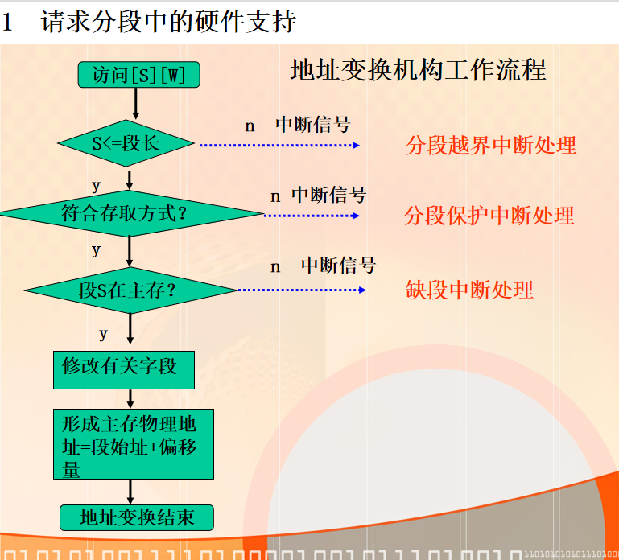
6. 缺段中断：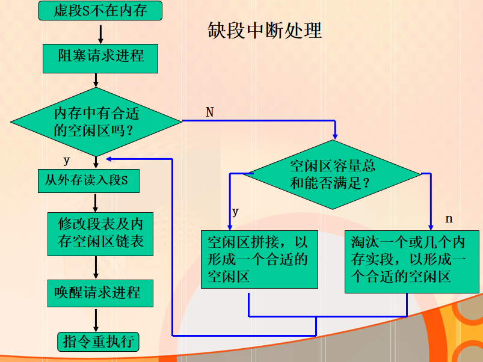
### 分段共享与保护：
1. 共享段设计：
   1. 系统中配置一个共享段表，所有共享段都在其中有一项。
   2. *共享进程计数字段*：仅当其为0时（即没有进程需要这个共享段了），才能由系统回收这些内存。
   3. *存取控制*：不同进程对共享段有不同存取权限。
   4. 对不同进程，统一共享段的段号不同。
   
2. 共享段分配回收方式：
   1. 分配：首次使用某个共享段，需要调入内存，修改共享段表，count置为1。当有其他进程再次使用，count+1.
   2. 回收：某个进程不再使用这个共享段，count-1.当count=0时，系统回收这个共享段。
3. 共享段*通常不被交换到外存*
4. 分段保护：
   1. 越界检查 
   2. 存取控制检查
   3. 环保护机构：优先级分为多个环。内环优先级最高，os核心位于0环，而用户应用位于外环。一个程序可以访问位于低/相同优先级环的数据；一个程序可以调用位于高/相同优先级环的服务。
   

# 第六章 设备管理
I/O设备管理：I/O系统。通常位于内核。是**操作系统中最繁杂且与硬件最紧密相关的部分**
1. 设备管理对象：I/O设备，设备控制器和I/O通道
2. 基本任务：完成用户IO请求，提高IO效率，IO设备利用率
3. 主要功能：缓冲区管理，设备分配，设备处理，虚拟设备，实现设备独立性
## IO系统概述
### IO系统组成
##### IO设备
1. 按**传输速率**分类
   低速（几字节至数百字节/秒）：键盘、鼠标、语音输入输出设备。
   中速（数千至数万字节/秒） ：行式打印机、激光打印机。
   高速（数千字节以上/秒） ：磁盘、光盘、以太网、图形显示设备
2. 按信息交换单位分类（**信息组织方式**）:
   1. 块设备:信息存取*以数据块为单位*(如磁盘，DMA方式，可寻址)
   2. 字符设备:以字符为单位。（打印机，中断方式，不可寻址）
3. **共享属性**分类：独占：如打印机；共享：如磁盘；虚拟：虚拟技术*将一台独占设备变换为若干台逻辑设备*，供多个进程同时使用。
4. 设备与控制器之间的接口传输的信号类型:
   1. 数据信号：控制器到设备（输出）、设备到控制器（输入）
   2. 控制信号：控制器到设备
   3. 状态信号：设备到控制器
   4. 这些控制器一般称为卡，如网卡、图形加速卡
##### IO管理目标
1. 提供统一界面、方便用户使用.使用*逻辑操作和逻辑名称*代替IO设备物理细节.程序对设备具有独立性:源/目标程序都使用设备符号名;提供设备管理和文件文件系统的统一接口；向程序提供设备重定向功能
2. 发挥系统的并行性，提高I/O设备使用效率:软硬结合技术,提高并行性.中断技术、缓冲技术、设备共享和假脱机技术.
3. 设备保护:掩盖细节的高级接口；命名与权限管理；只有特权指令才能使用设备硬件接口
##### IO管理功能
1. 缓冲区管理:系统各个部分负载不同,且执行速度和效率不同(CPU,IO设备速度差距大),引入缓冲区机制.
2. 外围设备的分配:   
   1. 设备分配程序:按照设备分类(独占,共享,虚拟)和分配算法来*分配设备,控制器和通道*.只要设备,控制器,通道有一个没有分配到,就进入等待队列.
3. 设备处理程序:驱动程序
4. 虚拟设备及实现设备独立性
## IO设备与控制器
I/O设备的*机械部件*主要用来执行具体的I/O操作。
I/O设备的*电子部件*通常是一块插入主板扩充槽的印刷电路板。
### IO设备的电子部件:控制器
电子部件就是设备控制器.CPU无法直接操作IO设备,所以需要中间媒介控制器,又由控制器控制IO设备的机械部件.
1. 接受CPU指令:有**控制寄存器**存储CPU发来的Read/Write指令和数据.
2. 向CPU发送状态:有**状态寄存器**存储状态,1表示可用,0表示占用.
3. 数据交换:有**数据寄存器**存储数据.输出时暂存CPU数据在寄存器中,输入时暂存后放入CPU.
4. 地址识别:对于每个寄存器都有"地址",根据CPU给出的地址来判断要操作哪个寄存器.
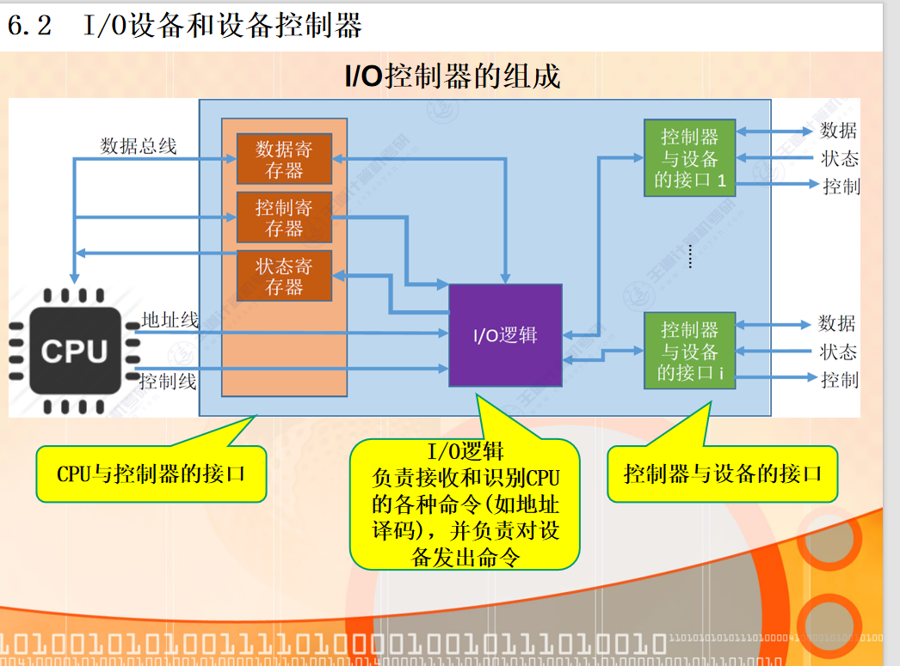
5. 细节:
   1. 一个IO控制器可能对应多个IO设备
   2. 数据/控制/状态寄存器可能有多个(每个对应一个设备).
   3. 有的计算机会让这些寄存器占用内存地址的一部分，称为**内存映像I/O**；另一些计算机则采用I/O专用地址，即**寄存器独立编址**
   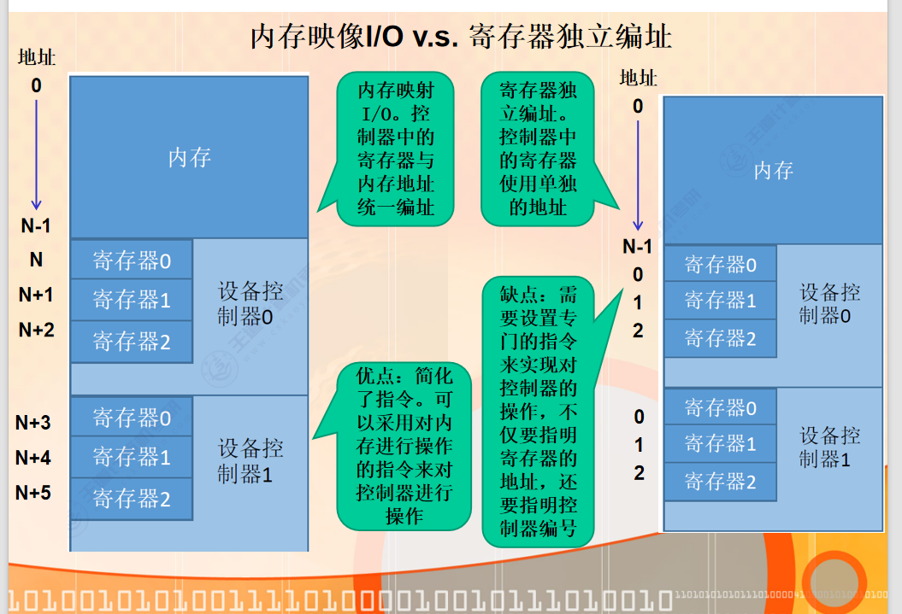
### 程序直接控制方式
##### 完成一次IO(读操作为例)

1. 首先CPU通过控制线发出读指令,启动IO设备,此时状态寄存器为0(未就绪).
2. CPU会轮询查询IO设备状态,不是1就重复查询.
3. 当设备准备好数据时,*将数据传送给控制器*,并报告自身状态为就绪.
4. 控制器将数据放入数据寄存器,并设置自身状态为1.
5. CPU发现已就绪,则将数据读入CPU寄存器,再放入内存
##### CPU干预的频率
很频繁.IO操作*完成前后都要CPU参与*(发指令,接收数据).且IO过程中CPU会不断轮询检查.
##### 数据传送的单位
每次读/写一个字
##### 数据的流向
读操作(数据输入)：I/O设备--》CPU(寄存器)--》内存
写操作(数据输出)：内存--》CPU(寄存器)--》I/O设备
每个字的读/写都需要CPU的帮助
##### 主要缺点和主要优点
1. 优点：实现简单,只需要发出指令后轮询等待即可.
2. 缺点：CPU和I/O设备只能*串行工作*，忙等,效率低
### 中断驱动方式
##### IO流程(读操作)
引入一个中断机制.
1. 过程:
   1. 当进程请求IO时,os**阻塞当前进程**,等待速度较慢的IO设备,转去执行其他进程.
   2. 当IO设备准备好后,*发出IO中断*,CPU检测到中断后,转入os的IO中断服务处理程序,CPU从IO中读出多个字,然后保存当前进程,恢复原等待IO的进程环境,重新执行原进程.
2. CPU每个指令周期末尾检查中断.
3. 中断发生和处理消耗系统资源.若中断频率过高则降低系统效率.
##### CPU干预的频率
**频率低很多**，每次I/O操作开始之前、完成之后需要CPU介入，等待I/O完成的过程中CPU可以切换到别的进程执行。
##### 数据传送的单位
每次读/写一个字。
##### 数据的流向
读操作(数据输入)：I/O设备--》CPU--》内存
写操作(数据输出)：内存--》CPU--》I/O设备
每个字的读/写都需要CPU的帮助。
##### 主要缺点和主要优点
优点：CPU与IO并行,提高效率.
缺点：每个字在I/O设备与内存之间的传输，都需要经过CPU。而频繁的中断处理会消耗较多的CPU时间。
## 缓冲管理
缓冲区是*两设备之间*或*设备与程序*之间保存数据的内存区域.
1. 引入缓冲区原因:
   1. 生产者和消费者速度不匹配
   2. 协调传输数据大小不一致的设备:网络中发送方发送多个报文段,接收方在*缓冲区拼接为完整报文*
   3. 减少对CPU的中断频率:若每次读取CPU中断处理1ns,则设置8位缓冲时,CPU每8位中断一次,变为平均1/8ns
   4. 提高CPU和I/O设备之间的并行性
2. *单缓冲*:进程发出IO请求时,os在主存设置*一个缓冲区*.CPU,外存轮流使用.
3. *双缓冲*:加快输入输出速度.先向第一缓冲区输入数据,*装满后转向第二缓冲区*.此时os从第一缓冲区取出数据,向第二缓冲区输入数据.要求**CPU和外设速率相近**
4. *循环缓冲*:多个缓冲区,循环使用.CPU速率可以和外设差距较大.
5. 2-4属于专用缓冲区,进程多时占用大量内存,利用率低.**现在多使用公用缓冲池，池中设置了多个供若干进程共享的缓冲区。**
缓冲池:
   1. 可用于输入/输出
   2. 有三类缓冲区：
   空闲缓冲区队列emq
   输入缓冲区队列inq：由装满输入数据的缓冲区链成的队列。
   输出缓冲区队列outq：由装满输出数据的缓冲区链成的队列。
   3. 对缓冲区进行的操作:
   收容输入：设备输入数据
   提取输入：计算进程读入数据
   收容输出：计算进程输出数据
   提取输出：向设备输出数据。
   访问各个缓冲区队列时，需进行**互斥操作**。
## IO软件
要求高效性(CPU与IO设备并发性)和通用性(统一标准的方法,简单抽象清晰的接口)   
1. 标准化:
   1. *抽象、包装与软件分层*
   2. 具体方法:从不同设备中抽象出*通用类型*,以接口调用.具体实现在内核模块(驱动程序)中封装.
   3. 每个os接口不同,所以同一个设备可能有不同驱动程序.
   4. IO系统调用为上层应用程序包装了应用细节.
2. 设计目标:
   1. *与具体设备无关*:I/O软件*屏蔽设备的具体细节*,程序员无需知晓设备具体细节.
   2. *统一命令*:不同设备采用统一逻辑名称.软件以逻辑名访问设备,**可能同一逻辑名称的设备在不同情况下代表不同设备**.
   3. *错误的处理*:IO设备错误由接近硬件的底层实现,不让高层程序感知.
   4. *缓冲技术*
   5. *设备的分配和释放*
   6. 不同的I/O控制方式:不同设备IO控制不同（程序I/O、中断、DMA、通道）。
### IO软件层次结构
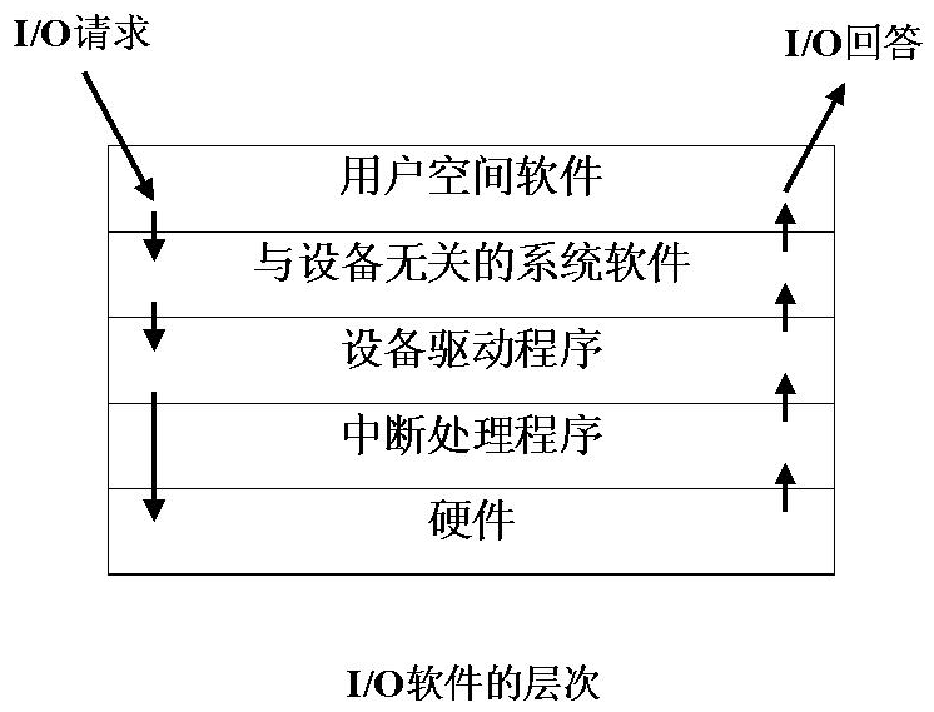
1. 不同层次
   1. 用户空间软件:负责**解释用户的应用请求**,并**转换为具体的输入/出操作**.将设备看做逻辑资源,为用户提供简单函数,以设备标识符来调用简单函数.
   2. 设备无关层:实现驱动程序接口,设备命名,逻辑设备名转换为物理设备名.设备的*分配和回收,缓冲区管理.*
   3. 设备驱动程序:**硬件直接相关**.发出控制命令
   4. 设备中断处理程序:**是驱动程序一部分**.阻塞等待IO的进程.当中断发生后,启动请求排队的下一请求,唤醒阻塞的进程.
2. 有关层负责将硬件细节封包.无关层负责向应用程序提供简单接口.*功能上看*，无关层是I/O管理的主要部分，从*代码量*看，驱动层是I/O管理的主要部分。
### 驱动程序
1. 功能
   1. 上层的*抽象要求转换为具体要求*,发送给控制器.
   2. 检查I/O请求的合法性，了解设备的状态，传递有关参数，设置设备的工作方式。
   3. 发出I/O命令，若设备空闲则启动。若设备忙，则将请求者的请求块挂在设备队列上。
   4. 响应通道或控制器发来的中断请求，调用相应的中断处理程序
   5. 设置有通道的，自动构成通道程序
2. 设备处理方式
   1. 作为**应用进程**一部分执行：与程序控制I/O相对应，难以对外设发出的中断作实时响应；
   2. 作为**系统进程**执行：为每类设备设置一个进程；或整个系统设置一个I/O进程，负责对各类设备的I/O进程的管理；也可设置一个输入进程和一个输出进程；
   3. **不设进程**，作为OS核心中的设备驱动程序，供用户或系统进程调用。
3. 设备驱动程序的特点:
   1. 是IO请求和设备控制器的桥梁.
   2. 向上屏蔽设备细节
   3. 驱动程序**允许可重入**,一个运行中的驱动程序可以被再次调用
4. 设备驱动程序的**处理过程**:
   1. 将抽象要求转化为具体要求。
   检查I/O请求的合法性
   读出和检查设备的状态
   传送参数
   设置工作方式
   启动I/O设备
   2. 具体IO操作由控制器完成.此时*驱动程序阻塞自己,知道中断到来*
### 设备独立性软件
1. **设备无关性**:
   1. 定义:除了直接操作硬件的底层软件，其它软件不依赖于硬件。可以*提高软件的设计效率*。
   2. 实现方式:引入物理设备、逻辑设备
   3. **应用程序使用逻辑设备名,os调用物理设备名**.OS负责将逻辑设备名转换为物理设备名
   4. 好处:*设备选择灵活*,os可以选择空闲的物理设备来满足请求的逻辑设备;*实现I/O重定向*:实现操作的设备可以更换,而*无需修改代码实现*
2. 设备独立性软件:
   1. 驱动程序之上，二者界限因操作系统不同而不同
   2. 主要功能:
   > 1. *执行所有设备的公有操作*.例如设备分配和回收;逻辑名映射为物理名;**找到驱动程序**;保护设备,禁止用户访问;缓冲管理;差错控制;提供独立于设备的逻辑块:每个设备使用数据块不同,*设备独立性软件负责将不同的数据块转变为相同的标准块给到高层*
   > 2. *为用户提供接口*
3. **逻辑设备名→物理设备名**:
   1. 逻辑设备表（LUT）:
   2. 每当进程调用一个*逻辑设备*时,os分配一个物理设备,并*新增一个LUT表项*.
   3. *LUT建立方式*:整个系统一张,不能有相同逻辑名称;每个用户一张,放入PCB.
### 用户层IO软件
大部分IO软件位于内核层.但也存在用户层的.
用户层软件*必须通过一组系统调用获取操作系统服务*
## 设备分配与回收
进程请求IO时,如果可能(可用)且安全,则通过某些策略分配一个设备,控制器,管道,*建立一条数据传输通路*.
1. 分配时需要考虑: *设备的固有属性*:独占(打印机),共享(宏观上共享并行,微观上串行),虚拟(SPOLLING技术*将独占设备虚拟化*,共享给多个进程使用)
2. 设备的**分配算法**：先来先服务、优先级高者优先、短任务优先
3. 从进程运行的**安全性**上考虑，设备分配有两种方式:
   1. *安全*分配方式:分配后阻塞进程,直到IO完成后唤醒.破坏了**请求和保持**条件，不会死锁;但对于进程而言,CPU与进程串行执行.
   2. *不安全*分配方式:分配后不阻塞进程.进程还可以请求其他IO设备.*仅当IO设备得不到满足时才阻塞进程*.IO设备与CPU并行处理,但可能死锁.
### 具体分配方式
1. 分配方式:
   1. *静态分配*：进程运行前*为其分配全部所需资源*，运行结束后归还资源.不死锁
   2. *动态分配*：进程运行过程中动态申请设备资源
2. 设备、控制器、通道的关系:一个通道控制多个设备控制器，每个设备控制器可控制多个设备。
3. *设备*控制表(DCT):
   1. 每个设备一张，描述*设备特性和状态*.
   2. 设备标识：唯一**物理设备名**
   -设备类型：设备特性；如：块设备或字符设备,打印机,键盘等；
   -设备配置：I/O地址等；
   -设备状态：忙/闲，等待/不等待；（若与设备链接的控制器或通道忙，则等待）
   -等待队列：等待使用该设备的进程队列； 
   -与设备连接的控制器表指针。
   -重复执行次数/时间:多次重复执行IO失败才算失败
4. *控制器*控制表(COCT, Controller Control Table):
   1. 每个设备控制器一张,描述*控制器的配置和状态*,如DMA控制器占用中断号,DMA数据通道的分配
   2. 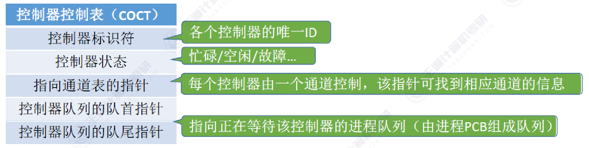
5. *通道*控制表(CHCT, Channel Control Table)
   1. 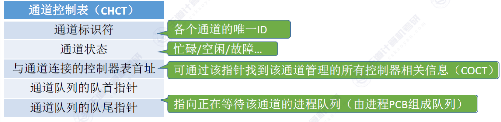
6. *系统设备*表(SDT, System Device Table):
   1. 系统内一张，记录**所有设备状态和设备控制表入口**
   2. 
7. 所有表的关系:
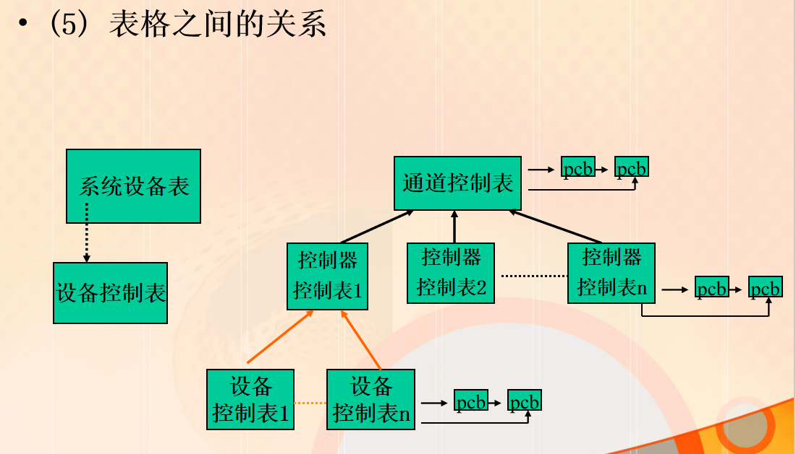
##### 独占设备分配
1. 分配过程
   1. *SDT→DCT*:根据进程请求的*物理设备名*查找SDT的设备标识符,找到设备控制表DCT.
   2. *查询状态*:若DCT状态空闲则分配设备给进程;*忙碌则将PCB挂到设备等待队列中*.
   3. *DCT→COCT*:根据DCT的*控制器表指针*找到COCT.COCT状态空闲则分配控制器;*忙碌则将PCB挂到控制器等待队列.*
   4. *COCT→CHCT*:根据COCT的*通道表指针*找到CHCT.CHCT空闲则分配通道;忙碌则PCB挂到通道等待队列.
2. **只有设备,控制器,通道**均分配成功,才能启动IO设备进行通信.
3. 缺点:必须提供物理设备名,物理设备更换则出错;若物理设备忙碌,则其他空闲的相同设备也无法使用,只能阻塞.解决方法:*使用逻辑设备名*
##### SPOOLing技术
Spooling:假脱机技术


