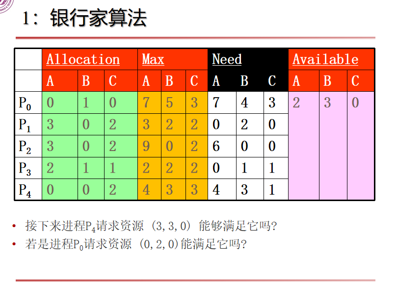
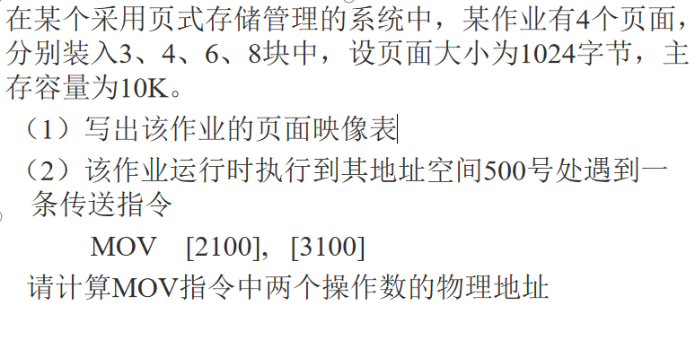

# 操作系统作业2
\[王子骏\ \ \ \ \ \ \ \ \ \ 9222127970152\]
## 第一题：银行家算法

##### 接下来进程$P_4$请求资源 (3,3,0) 能够满足它吗?
当前$Available=(2,3,0)$，而请求资源$(3,3,0)$，*只有$2$个$A$资源而$P_4$请求了$3$个*，无法满足。
##### 若是进程$P_0$请求资源 (0,2,0)能满足它吗?
1. *判断是否能够尝试分配*：
当前$Available=(2,3,0)$，而请求资源$(0,2,0)$，资源足够可以分配。
2. *尝试分配*：此时$Allocation[P_0] = (0,3,0)$，$Need[P_0]=(7,1,3)$，$Available=(2,1,0)$
3. *执行安全性算法*：
    1. 首先构造$Work=Available=(2,1,0)$，$Finish=(F,F,F,F,F)$，其中$F$表示False，$T$表示True。
    2. 对于$P_i(i \in [0,4])$判断是否有$Work=(2,1,0) > Need[p_i]$。
     3. 可以发现，$Work=(2,1,0)$无法满足$P_0$的$A,C$需求；无法满足$P_1$的$B$需求；无法满足$P_2$的$A$需求；无法满足$P_3$的$C$需求；无法满足$P_4$的$ABC$需求；
     4. 此时发现$Finish$向量全为False，进入死锁状态。
4. **安全性算法发现，若分配$(0,2,0)$给$P_0$会进入不安全状态，不分配**。
## 第二题

由于页面大小为$1024=2^{10}$字节，主存容量为$10K=5 × 2^{11}$字节，所以物理页框数量为$\frac{5 × 2^{11}}{2^{10}}=10个$，且逻辑地址后$10$位表示页内偏移，前$4$位表示页号。
##### 写出该作业的页面映像表
|逻辑页号|物理页框号|
|---|---|
|0|3|
|1|4|
|2|6|
|3|8|
##### 请计算MOV指令中两个操作数的物理地址
1. $2100 = $ **$0010$** $0000110100$、$3100 = $ **$0011$** $0000011100$
2. 第一个操作数$[2100]$的逻辑页号为$0010 = 2$，页内偏移为$0000110100 = 52$；第二个操作数$[3100]$的逻辑页号为$0011 = 3$，页内偏移为$0000011100 =28$
3. *查询页面映像表可知*，第一个操作数对应的物理页框号为$6$，该页框的起始地址为$1024 × 6 = 6144$，则**第一个操作数实际地址为$6144 + 52 = 6196$**
4. *查询页面映像表可知*，第二个操作数对应的物理页框号为$8$，该页框的起始地址为$1024 × 8 = 8192$，则**第二个操作数实际地址为$8192 + 28 = 8220$**

